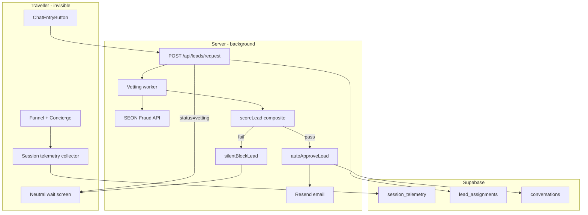

# Background Lead Vetting (Replace Advisor Acceptance)

## Strategic shift

**Current flow (to remove):** Traveller requests chat → advisor sees pending lead → Accept/Reject → email on accept → cascade on reject ([`respond-lead`](advisor-profile/app/api/advisor/respond-lead/route.ts), [`PendingLeadCard`](advisor-profile/components/advisor/PendingLeadCard.tsx)).

**New flow:** Traveller requests chat → background vetting runs invisibly → **pass** = auto-create conversation + email chat link for the **originally chosen advisor** → **fail** = silent block (same neutral wait UI, no email, no chat, no cascade).



---

## Phase 1 — Session telemetry (passive, zero friction)

### Goal
Capture behavioral signals during the funnel and concierge chat without asking the user anything extra.

### [NEW] `lib/telemetry/types.ts`
Define a typed payload:
- `stepDwellMs`: per-step times (`destination`, `budget`, `style`, `chat`, `matching`, `results`)
- `totalFunnelMs`: wall-clock from first step to lead request
- `conciergeMetrics`: user turn count, avg reply latency, paste-detected flag, avg keystroke interval
- `deviceSignals`: pointer variance bucket, tab-hidden count (optional, privacy-safe aggregates only)

### [NEW] `lib/telemetry/collector.ts` + `hooks/useSessionTelemetry.ts`
- Start timer on first funnel step mount ([`app/page.tsx`](advisor-profile/app/page.tsx), [`app/start/page.tsx`](advisor-profile/app/start/page.tsx))
- Record `enteredAt` / `exitedAt` on each step component (`StepDestination`, `StepBudget`, `StepTravelStyle`, `StepAIConcierge`, `StepMatching`, `StepResults`)
- In concierge: detect paste events (`input` events where `inputType === 'insertFromPaste'` or length jump > 80 chars in <50ms)
- Persist to `sessionStorage` key `tbo_session_telemetry`; flush on lead request

### [NEW] migration `supabase/migrations/[timestamp]_session_telemetry.sql`
```sql
create table public.session_telemetry (
  id               uuid primary key default gen_random_uuid(),
  match_session_id uuid references public.match_sessions(id) on delete cascade,
  traveller_user_id uuid references public.users(id) on delete set null,
  payload          jsonb not null,
  created_at       timestamptz not null default now()
);
```
- RLS: travellers insert/read own rows; service role for vetting worker

### [MODIFY] [`POST /api/match-sessions`](advisor-profile/app/api/match-sessions/route.ts)
- Accept optional `telemetry` in body; upsert into `session_telemetry` linked to `matchSessionId`

---

## Phase 2 — SEON integration (identity + fraud)

### [NEW] `lib/vetting/seon.ts`
Server-only SEON Fraud API client.

**Input (from auth session + request):**
- `email` (from `auth.users.email`)
- `phone` (E.164 from verified Supabase phone)
- `ip` (from `x-forwarded-for` / `x-real-ip` in [`rateLimit.ts`](advisor-profile/lib/guardrails/rateLimit.ts) pattern)
- `user_id` (internal correlation id)

**Output (normalized internal type):**
- `fraudScore` (0–100)
- `emailAgeDays`, `emailDomainType` (corporate/free/disposable)
- `phoneRiskScore`
- `socialProfileCount` (LinkedIn/Facebook/etc. signals SEON returns)
- `ipCountry`, `ipType` (residential/datacenter/vpn)
- `rawTransactionId` (for audit, never log full PII)

**Env vars:** `SEON_API_KEY`, `SEON_API_URL` (default SEON production), `SEON_FRAUD_BLOCK_THRESHOLD` (e.g. 70)

**Reliability:** 5s timeout, 1 retry; on SEON outage → fail-open to behavioral-only scoring (configurable via `SEON_FAIL_OPEN=false` for production strict mode)

---

## Phase 3 — Composite vetting engine

### [NEW] `lib/vetting/scoreLead.ts`
Pure function: combines all signals into `vettingScore` (0–100) + `decision: 'pass' | 'block'` + `reasonCodes[]`.

| Signal | Source | Block/heavy-penalty examples |
|--------|--------|------------------------------|
| Readiness tier | existing [`match_sessions.readiness_*`](advisor-profile/supabase/migrations/20250612120000_match_sessions_readiness.sql) | `blocked` tier → immediate block |
| SEON fraud score | SEON API | score ≥ threshold → block |
| Email lifecycle | SEON | disposable domain, age < 7 days, zero social links → heavy penalty |
| Phone risk | SEON + existing OTP | burner/high-risk phone → block |
| Velocity trap | telemetry | total funnel < 4s OR any step < 1.5s → block |
| Paste bot pattern | telemetry | paste in concierge + speedrun → block |
| Geo affluence boost | SEON IP + optional zip | corporate IP / affluent geo → small positive boost (never sole pass reason) |
| Advisor prefs | existing [`advisorPreferenceFilter`](advisor-profile/lib/guardrails/advisorPreferenceFilter.ts) | re-check at request time; mismatch → block (silent) |

**Pass threshold:** e.g. `vettingScore >= 55` AND no hard-block reason codes.

### [NEW] `lib/vetting/rules.ts`
Individual rule functions (testable in isolation):
- `evaluateVelocityTrap(telemetry)`
- `evaluatePasteBot(telemetry)`
- `evaluateSeonIdentity(seonResult)`
- `evaluateReadinessGate(session)`

### [NEW] `lib/vetting/autoApproveLead.ts`
Extract conversation-creation logic from [`respond-lead/route.ts`](advisor-profile/app/api/advisor/respond-lead/route.ts) `finishAccept`:
1. Create conversation with chosen advisor
2. Save brief from sessionStorage / `conversation_briefs`
3. Link `match_session_id`, set `lead_assignment_id`
4. Set assignment `approved`, `match_sessions.lead_status = 'accepted'`
5. Call `sendTravelerAcceptedEmail` (updated copy — see Phase 5)
6. Optional: passive Expo push to advisor ("New verified client connected")

### [NEW] `lib/vetting/silentBlockLead.ts`
1. Set assignment `blocked`, `match_sessions.lead_status = 'blocked'`
2. Store `vetting_result` JSON (audit only, no user exposure)
3. **No email, no cascade, no advisor notification**
4. Return nothing to client (traveller stays on neutral wait screen)

---

## Phase 4 — Schema migration (repurpose `lead_assignments`)

### [NEW] migration `supabase/migrations/[timestamp]_lead_vetting.sql`

Extend [`lead_assignments`](advisor-profile/supabase/migrations/20250617120000_lead_assignments.sql):

```sql
-- Replace advisor-acceptance statuses with vetting lifecycle
alter table public.lead_assignments
  drop constraint if exists lead_assignments_status_check;

alter table public.lead_assignments
  add constraint lead_assignments_status_check
  check (status in ('vetting','approved','blocked','superseded'));

alter table public.lead_assignments
  add column if not exists vetting_score smallint,
  add column if not exists vetting_result jsonb,
  add column if not exists seon_transaction_id text;

-- match_sessions.lead_status: add 'blocked'
alter table public.match_sessions
  drop constraint if exists match_sessions_lead_status_check;
-- re-add with: pending | accepted | blocked | exhausted (exhausted unused after cascade removal)
```

**RLS changes:**
- **Remove** advisor `UPDATE` policy on `lead_assignments` (advisors no longer action leads)
- Advisors retain `SELECT` only on assignments where they are the assigned advisor (for post-approval conversation context if needed)
- Vetting writes use service-role in worker only

Update [`database.types.ts`](advisor-profile/lib/supabase/database.types.ts).

---

## Phase 5 — API and flow changes

### [MODIFY] [`POST /api/leads/request`](advisor-profile/app/api/leads/request/route.ts)
1. Accept `{ advisorRouteId, matchSessionId?, telemetry? }`
2. Persist telemetry to `session_telemetry` if provided
3. Insert `lead_assignments` with `status: 'vetting'` (not `pending`)
4. Set `match_sessions.lead_status = 'pending'` (vetting in progress)
5. **Remove** `notifyAdvisorOfPendingLead` call
6. Return `{ ok: true, status: 'vetting' }` immediately (no `expiresAt` exposed)
7. Fire-and-forget: `void runLeadVetting(assignmentId)` (same request context: IP, user, session)

### [NEW] `lib/vetting/runLeadVetting.ts`
Orchestrator called async from request route (and retryable from cron):
1. Load assignment + match_session + telemetry + brief
2. Call SEON
3. Run `scoreLead`
4. Branch: `autoApproveLead` or `silentBlockLead`
5. Structured log: `{ assignmentId, decision, score, reasonCodes }` (no PII)

### [NEW] `POST /api/cron/retry-stuck-vetting/route.ts`
- Re-process assignments in `vetting` status older than 2 minutes (SEON timeout recovery)
- Add to [`vercel.json`](advisor-profile/vercel.json): `*/15 * * * *`
- **Remove** or repurpose [`expire-pending-leads`](advisor-profile/app/api/cron/expire-pending-leads/route.ts) (advisor 24h timeout no longer applies)

### [DELETE / deprecate]
- [`app/api/advisor/respond-lead/route.ts`](advisor-profile/app/api/advisor/respond-lead/route.ts)
- [`lib/leads/cascade.ts`](advisor-profile/lib/leads/cascade.ts) (no cascade on silent block)
- [`lib/leads/notifyAdvisor.ts`](advisor-profile/lib/leads/notifyAdvisor.ts) pending-lead variant (replace with post-approval notify if desired)

### [MODIFY] [`lib/guardrails/rateLimit.ts`](advisor-profile/lib/guardrails/rateLimit.ts)
- Fix leads/request to use `leads-request` bucket (currently miswired to `match-sessions`)
- Remove `leads-respond` bucket

---

## Phase 6 — Traveller UI (invisible framing)

### [MODIFY] [`LeadSubmittedScreen.tsx`](advisor-profile/components/matching/LeadSubmittedScreen.tsx)
Neutral copy — no advisor name, no accept/reject language:
- *"We're reviewing your trip request. If everything checks out, we'll email you a secure link to start chatting with your advisor shortly."*
- Remove expiry countdown (vetting is minutes, not 24h advisor wait)
- **Do not** poll for rejection; optional silent poll for `approved` → auto-redirect to `/chat/[id]` without explaining why

### [MODIFY] [`ChatEntryButton.tsx`](advisor-profile/components/chat/ChatEntryButton.tsx)
- Attach telemetry payload from `readSessionTelemetry()` on request
- Handle `status: 'vetting'` response (show wait screen)
- Optional: subscribe to `lead_assignments` realtime for `approved` → redirect (better UX than email-only)

### No changes needed to funnel entry points beyond telemetry hooks — OTP gate stays in `ChatEntryButton`.

---

## Phase 7 — Advisor UI cleanup

### Remove advisor acceptance UX entirely
| File | Action |
|------|--------|
| [`PendingLeadCard.tsx`](advisor-profile/components/advisor/PendingLeadCard.tsx) | Delete |
| [`usePendingLeads.ts`](advisor-profile/hooks/usePendingLeads.ts) | Delete |
| [`fetchPendingLeads.ts`](advisor-profile/lib/leads/fetchPendingLeads.ts) | Delete |
| [`ChatSidebar.tsx`](advisor-profile/components/chat/ChatSidebar.tsx) | Remove pending leads section |
| [`ChatShell.tsx`](advisor-profile/components/chat/ChatShell.tsx) | Remove `usePendingLeads` wiring |

Advisors only see conversations after vetting auto-approves (existing inbox).

---

## Phase 8 — Email updates

### [MODIFY] [`lib/email/resend.ts`](advisor-profile/lib/email/resend.ts)
Update `sendTravelerAcceptedEmail` copy:
- Subject: *"Your TravelConnect chat is ready"*
- Body: *"Your trip request has been verified. [Advisor Name] is ready to help you plan your [Destination] trip."*
- Remove "reviewed and accepted" language

### [DELETE] `sendLeadExpiredEmail` usage
No expiry email on silent block (user sees neutral wait screen only). Keep function for ops/admin use or remove if unused.

---

## Phase 9 — Tests

### [NEW] `__tests__/vettingScore.test.ts`
- Velocity trap: funnel < 4s → block
- Per-step < 1.5s → block
- Paste + speedrun → block
- SEON mock: disposable email → block
- SEON mock: corporate email + mature social → pass boost
- Readiness `blocked` → hard block regardless of other signals
- Composite pass at threshold

### [NEW] `__tests__/seon.test.ts`
- Normalizes SEON response shape
- Timeout/fail-open behavior

### [UPDATE] `__tests__/leadAssignment.test.ts`
- Remove cascade tests; add vetting status transition tests

---

## Phase 10 — Ops checklist

| Env var | Purpose |
|---------|---------|
| `SEON_API_KEY` | SEON Fraud API |
| `SEON_FRAUD_BLOCK_THRESHOLD` | Block if SEON score ≥ N (default 70) |
| `VETTING_PASS_THRESHOLD` | Composite pass score (default 55) |
| `SEON_FAIL_OPEN` | `true` = skip SEON on outage; `false` = block |
| `RESEND_API_KEY`, `RESEND_FROM_EMAIL` | Unchanged |
| `CRON_SECRET` | For retry-stuck-vetting cron |

**Privacy/compliance:** Document lawful basis for fraud prevention; never expose vetting scores to travellers; retention policy for `vetting_result` JSON (recommend 90-day TTL cron).

**Observability:** Log `decision`, `score`, `reasonCodes` only — never email/phone in logs.

---

## Implementation order (recommended)

1. Telemetry collector + DB (Phase 1) — no behavior change yet
2. SEON client + score engine + unit tests (Phases 2–3)
3. Schema migration + types (Phase 4)
4. Rewire `/api/leads/request` + `runLeadVetting` + auto-approve/block (Phase 5)
5. UI copy + remove advisor queue (Phases 6–7)
6. Email copy + cron retry (Phases 8, 5 cron)
7. Delete deprecated files + update tests (Phase 9)

---

## What gets removed vs kept from current double opt-in

| Keep | Remove |
|------|--------|
| `lead_assignments` table (repurposed) | Advisor accept/reject API + UI |
| `ChatEntryButton` auth + OTP gate | 24h advisor expiry cron |
| Resend on **pass** only | Cascade to next advisor |
| Phone OTP ([`PhoneVerificationModal`](advisor-profile/components/matching/PhoneVerificationModal.tsx)) | Pending lead push ("review and accept") |
| Readiness scoring (as one signal) | `LeadSubmittedScreen` advisor-specific copy |
