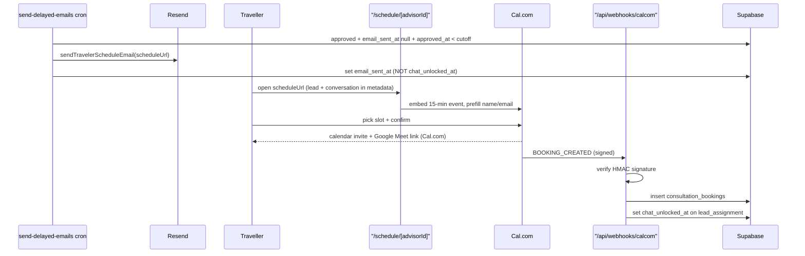

# Cal.com Scheduling Flow

Replace the post-verification chat link with a Cal.com booking flow. Video call is the deliverable (Cal.com auto-generates the Google Meet/Zoom invite + reminders); default slot is 15 minutes. In-app chat is unlocked when a booking is confirmed (so there's a place for pre/post-call follow-up), instead of at email-send time.

## Architecture

## Key design decisions
- Correlate bookings to leads via Cal.com booking `metadata` (`leadAssignmentId`, `conversationId`) passed from the schedule page; do not rely on email matching.
- For MVP advisor onboarding, advisor pastes their public Cal.com event link (e.g. `cal.com/jane/discovery-15min`) in profile settings rather than full OAuth/managed-user provisioning. This avoids Cal.com Platform complexity while still embedding a white-labeled widget.
- Cal.com owns timezone math, calendar sync, confirmation emails, the Meet/Zoom link, and reminder workflows (no-show mitigation) - configured once per advisor in Cal.com.

## Data model (new migration in `advisor-profile/supabase/migrations/`)
- `advisor_scheduling`: `user_id` (PK, FK users), `advisor_route_id`, `calcom_link` (text, e.g. `username/discovery-15min`), `default_duration_min` (default 15), `connected_at`. Used to render the embed and to know an advisor is "schedule-ready".
- `consultation_bookings`: `id`, `lead_assignment_id` (FK), `conversation_id`, `advisor_user_id`, `traveller_user_id`, `calcom_booking_uid` (unique), `start_time`, `end_time`, `meeting_url`, `status` (`booked`/`cancelled`/`rescheduled`), `created_at`. Idempotency key = `calcom_booking_uid`.
- Regenerate `advisor-profile/lib/supabase/database.types.ts` after migration.

## Backend changes
- `advisor-profile/lib/email/resend.ts`: add `sendTravelerScheduleEmail({ to, advisorName, destination, scheduleUrl })` with CTA "Schedule your Consultation". Keep `sendTravelerAcceptedEmail` for the legacy (`LEAD_VETTING_ENABLED=false`) path.
- `advisor-profile/app/api/cron/send-delayed-emails/route.ts`: build `scheduleUrl = ${getSiteUrl()}/schedule/${row.advisor_route_id}?lead=${row.id}`; call `sendTravelerScheduleEmail`; set only `email_sent_at` (remove `chat_unlocked_at` from this update so chat unlocks on booking).
- New `advisor-profile/app/api/webhooks/calcom/route.ts`: verify `X-Cal-Signature-256` HMAC against `CALCOM_WEBHOOK_SECRET`; handle `BOOKING_CREATED` (upsert `consultation_bookings`, set `lead_assignments.chat_unlocked_at = now`), `BOOKING_CANCELLED`/`BOOKING_RESCHEDULED` (update status). Idempotent on `calcom_booking_uid`. Structured logging, no PII in logs.
- New `advisor-profile/lib/scheduling/calcom.ts`: helpers for signature verification, webhook payload parsing/validation (zod), and reading `advisor_scheduling`.

## Frontend changes
- New `advisor-profile/app/schedule/[advisorId]/page.tsx`: server-load `advisor_scheduling` by `advisor_route_id`; require traveller auth; render Cal.com embed via `@calcom/embed-react` (`Cal` with `calLink`, prefill name/email from session, and `config.metadata = { leadAssignmentId, conversationId }`). Graceful fallback if advisor not schedule-ready.
- `advisor-profile/components/advisor/AdvisorSelfProfileEditor.tsx`: add a "Consultation scheduling" section (Cal.com link input + 15-min default + short setup instructions), saving to `advisor_scheduling`.
- Update copy in `advisor-profile/components/matching/LeadSubmittedScreen.tsx` and `advisor-profile/components/chat/TravellerChatLocked.tsx` from "start chatting" to a scheduling-oriented message.

## Dependencies / env
- Add `@calcom/embed-react`.
- New env: `CALCOM_WEBHOOK_SECRET` (HMAC verify), optional `CALCOM_API_KEY` (if later using REST for availability/validation). Document in env example.

## Testing
- Unit: webhook signature verification (valid/invalid), cron email selection + `email_sent_at` set without `chat_unlocked_at`, booking idempotency.
- E2E (`advisor-profile/e2e/`): extend lead-vetting flow - approved lead -> schedule email -> simulated `BOOKING_CREATED` webhook -> `chat_unlocked_at` set -> traveller chat accessible.

## Open follow-ups (non-blocking)
- Confirm whether chat should unlock on booking (assumed yes) vs only at slot start time.
- Advisor connection UX: MVP paste-link now; consider Cal.com OAuth/managed users later for true in-app calendar connect.