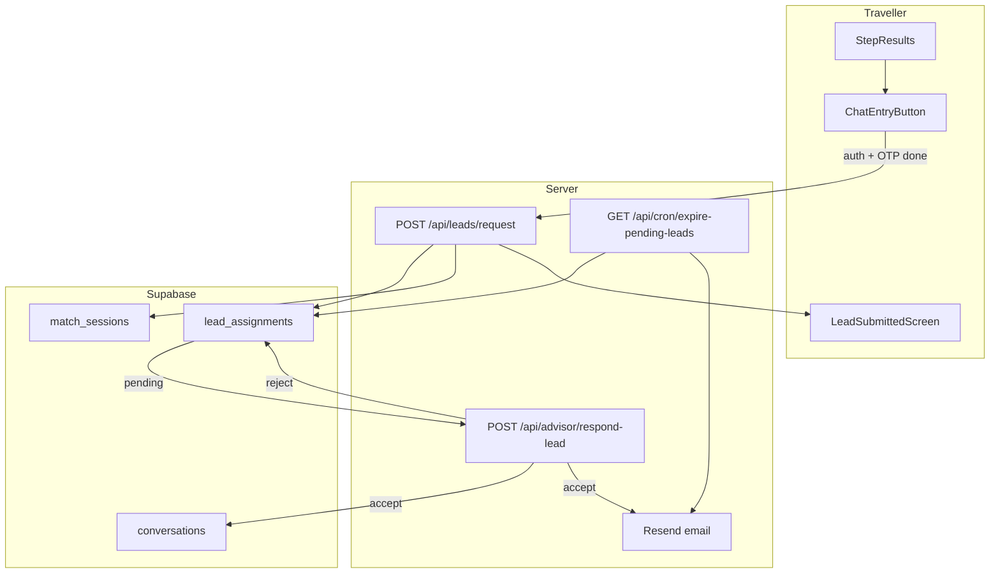

# Revised Plan: Lead Acceptance and Email Flow (Double Opt-in)

## Rating of current [implementation_plan.md](implementation_plan.md): **4.5 / 10**

**What it gets right (+)**
- Clear product goal: protect advisor time via explicit accept/reject before chat
- Sensible tradeoff callout (friction vs quality)
- Resend is a good fit for Next.js transactional email
- 24h timeout and auto-cascade on reject are reasonable business rules

**Critical shortcomings (-)**

| Issue | Why it matters |
|-------|----------------|
| **Wrong integration point** | Plan says change funnel end in [`app/start/page.tsx`](advisor-profile/app/start/page.tsx) after OTP. Actual gate is [`ChatEntryButton`](advisor-profile/components/chat/ChatEntryButton.tsx): auth → phone OTP → [`openChatWithAdvisor`](advisor-profile/lib/chat/conversations.ts) → `/chat/[id]`. |
| **Schema conflict** | Proposes `conversations.status` = `pending_advisor` / `rejected` / `expired`, but Phase 5 already uses `status IN ('active','archived','completed')` for ghost prevention ([migration](advisor-profile/supabase/migrations/20250616120000_conversation_ghost_prevention.sql)) and inbox filters `status = 'active'` ([`inbox.ts`](advisor-profile/lib/chat/inbox.ts)). Overloading `status` would break ghost logic. |
| **Ignores existing infra** | Expo push on new matches already exists ([`notifyMatchedAdvisors.ts`](advisor-profile/lib/push/notifyMatchedAdvisors.ts)); `match_sessions.advisor_ids` + `conversations.match_session_id` already link funnel to chat ([migration](advisor-profile/supabase/migrations/20250608120000_mobile_push_and_advisor_match_access.sql)). |
| **Reassignment underspecified** | `match_sessions` stores a static top-3 array with no assignment state, attempt order, or current assignee. Auto-cascade cannot work without a new table or columns. |
| **Cron pattern mismatch** | Plan assumes Supabase `pg_cron`. Project already uses **Vercel cron** for stale-lead archival ([`app/api/cron/archive-stale-leads/route.ts`](advisor-profile/app/api/cron/archive-stale-leads/route.ts)). |
| **Dual funnel gap** | Only mentions `/start`; [`app/page.tsx`](advisor-profile/app/page.tsx) is an equally valid entry point. |
| **Message blocking not addressed** | Existing DB trigger rejects inserts when `conversations.status != 'active'`. Pending leads must block messaging without breaking ghost archival. |
| **Weak verification** | "N/A for automated tests" for a multi-state workflow is risky. |
| **Security gaps** | `respond-lead` API sketched without advisor authz, idempotency, or rate limits. |

---

## Revised architecture

Separate **lead acceptance** from **ghost prevention** using a dedicated assignment table. Keep `conversations.status` for the existing ghost state machine.



---

## 1. Database schema (Supabase)

### [NEW] `lead_assignments` table (do not overload `conversations.status`)

```sql
-- lead_assignments: one row per advisor attempt for a traveller request
create table public.lead_assignments (
  id                uuid primary key default gen_random_uuid(),
  match_session_id  uuid not null references public.match_sessions(id) on delete cascade,
  traveller_user_id uuid not null references public.users(id) on delete cascade,
  advisor_user_id   uuid not null references public.users(id) on delete cascade,
  advisor_route_id  text not null,
  rank              smallint not null check (rank between 1 and 3),
  status            text not null default 'pending'
    check (status in ('pending','accepted','rejected','expired','superseded')),
  conversation_id   uuid references public.conversations(id) on delete set null,
  created_at        timestamptz not null default now(),
  responded_at      timestamptz,
  expires_at        timestamptz not null default (now() + interval '24 hours')
);
```

- **Unique partial index**: one `pending` assignment per `match_session_id` at a time
- **RLS**: travellers read own rows; advisors read/update rows where `advisor_user_id = auth.uid()` and `status = 'pending'`
- **On accept**: create conversation (or reuse), set `conversation_id`, set assignment `accepted`; link via existing [`link_conversation_to_match_session`](advisor-profile/supabase/migrations/20250608120000_mobile_push_and_advisor_match_access.sql)
- **On reject**: mark `rejected`, insert next rank from `match_sessions.advisor_ids` as new `pending` row (auto-cascade per your choice)
- **If all 3 reject/expired**: set a `match_sessions.lead_status = 'exhausted'` column (new nullable text) and email traveller

### Conversations: minimal change

- Add optional `lead_assignment_id uuid` FK for traceability
- **Do not** change ghost `status` enum; pending leads simply have **no conversation yet** (or conversation created only on accept)

### Expiry cron (Vercel, not pg_cron)

- [NEW] [`app/api/cron/expire-pending-leads/route.ts`](advisor-profile/app/api/cron/expire-pending-leads/route.ts)
- Add schedule to [`vercel.json`](advisor-profile/vercel.json) (hourly: `0 * * * *`)
- Service-role client expires `pending` rows past `expires_at`, cascades or marks exhausted, sends Resend email

---

## 2. Traveller flow changes

**Integration point:** [`ChatEntryButton.tsx`](advisor-profile/components/chat/ChatEntryButton.tsx) and [`openChatWithAdvisor`](advisor-profile/lib/chat/conversations.ts) — not the funnel pages directly.

### [NEW] `POST /api/leads/request`

Called after auth + phone OTP succeed, **instead of** immediate `get_or_create_direct_conversation`.

Body: `{ advisorRouteId, matchSessionId? }`

Server steps:
1. Verify session + `phone_confirmed_at` (mirror existing RPC check)
2. Resolve advisor via `advisor_user_links`
3. Validate traveller is not re-requesting an already-accepted assignment for same session
4. Insert `lead_assignments` row (rank derived from position in `match_sessions.advisor_ids`, default rank 1 for chosen advisor)
5. Notify advisor via existing Expo push + optional in-app badge
6. Return `{ ok: true, assignmentId, status: 'pending', expiresAt }`

### [NEW] `components/matching/LeadSubmittedScreen.tsx`

Shown when request is pending (modal or inline in `ChatEntryButton`):
- Copy: *"Your trip brief has been sent to [Advisor Name]. We'll email you a secure link to start chatting once they accept your request (usually within 24 hours)."*
- No redirect to `/chat/[id]` while `status = 'pending'`

### [MODIFY] Both funnel entry points

- [`components/matching/StepResults.tsx`](advisor-profile/components/matching/StepResults.tsx) — no OTP changes needed (already delegated to `ChatEntryButton`)
- Ensure [`app/page.tsx`](advisor-profile/app/page.tsx) and [`app/start/page.tsx`](advisor-profile/app/start/page.tsx) handle resume if user returns with pending assignment

---

## 3. Advisor dashboard and lead queue

### [NEW] `lib/leads/fetchPendingLeads.ts`

Query `lead_assignments` joined with `match_sessions` + `conversation_briefs` (or brief JSON on session) for advisor inbox.

### [NEW] `components/advisor/PendingLeadCard.tsx`

- Destination, budget, readiness tier, AI brief summary (reuse [`AdvisorBriefPanel`](advisor-profile/components/AdvisorBriefPanel.tsx) compact mode)
- Actions: **Accept** / **Pass**
- Show countdown to `expires_at`

### [MODIFY] [`components/chat/ChatSidebar.tsx`](advisor-profile/components/chat/ChatSidebar.tsx) or advisor shell

- Add **Pending Leads** tab/section above active inbox
- Badge count for `status = 'pending'`

### [NEW] `POST /api/advisor/respond-lead`

Body: `{ assignmentId, action: 'accept' | 'reject' }`

Server steps:
1. Auth required; `account_role = 'advisor'`
2. Verify `assignment.advisor_user_id = auth.uid()` and `status = 'pending'`
3. Rate limit (reuse [`checkRateLimit`](advisor-profile/lib/guardrails/rateLimit.ts))
4. **Accept**: `get_or_create_direct_conversation(traveller_user_id)`, save brief, link match session, set assignment `accepted`, send Resend email to traveller
5. **Reject**: set `rejected`, call `cascadeToNextAdvisor(match_session_id)` — insert next rank from `advisor_ids`, notify via Expo push
6. Idempotent: second accept/reject returns current state, no duplicate emails

---

## 4. Email infrastructure (Resend)

### [NEW] `lib/email/resend.ts`

- `RESEND_API_KEY`, `RESEND_FROM_EMAIL` env vars
- `sendTravelerAcceptedEmail({ to, advisorName, destination, chatUrl })`
- `sendLeadExpiredEmail({ to, destination })`

### [NEW] `components/email/TravelerAcceptedEmail.tsx`

React Email template with signed/deep link to `/chat/[conversationId]`

### Traveller email source

Use `auth.users.email` from session (already required for OAuth/email sign-in). Do not collect email separately.

---

## 5. Interaction with existing guardrails

| Existing system | How double opt-in fits |
|-----------------|------------------------|
| Phone OTP ([`PhoneVerificationModal`](advisor-profile/components/matching/PhoneVerificationModal.tsx)) | Stays as pre-request gate; unchanged |
| Readiness tiers / blocked leads | Blocked leads never reach `StepResults`; nurture banner unchanged |
| Ghost prevention (48h) | Starts only after conversation is `active` post-accept |
| Expo push | Reuse for pending lead notifications; email is traveller-only supplement |
| `match_sessions` | Source of truth for top-3 `advisor_ids` and brief/readiness analytics |

---

## 6. Verification plan (replaces "N/A")

### Unit tests (Vitest)

- `cascadeToNextAdvisor` — rank 1 reject → rank 2 pending; rank 3 reject → exhausted
- Expiry logic — pending past 24h → expired + cascade
- Idempotent accept/reject responses

### Manual E2E

1. Traveller: funnel → results → Chat → OTP → **wait screen** (not chat)
2. Advisor: pending lead visible → Accept → traveller receives email → chat opens
3. Reject path: advisor Pass → next advisor gets pending assignment + push
4. Expiry: advance `expires_at` in DB → cron emails traveller and cascades
5. Ghost prevention still archives stale **accepted** conversations after 48h

---

## 7. Env and ops checklist

- `RESEND_API_KEY`, `RESEND_FROM_EMAIL` (verified domain)
- `CRON_SECRET` for expire endpoint (same pattern as existing archive cron)
- Update [`database.types.ts`](advisor-profile/lib/supabase/database.types.ts) after migration

---

## Suggested rewrite of implementation_plan.md

Replace the current file content with the sections above, removing:
- pg_cron references
- `conversations.status` enum overwrite
- OTP-at-funnel-end assumptions
- "N/A for automated tests"

**Revised plan score if implemented as written: ~8.5/10** — actionable, codebase-aligned, with clear schema separation and test coverage.
