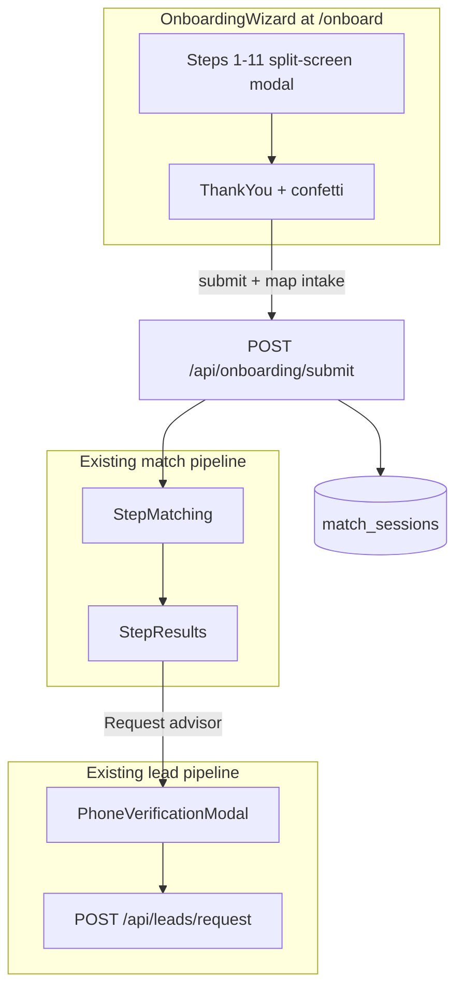

# Fora-Style 11-Step Onboarding Wizard

## Product decisions (confirmed)

- **Post-submit:** Run matching immediately, show advisor cards, require phone OTP before requesting an advisor (reuse [`ChatEntryButton`](advisor-profile/components/chat/ChatEntryButton.tsx) + [`PhoneVerificationModal`](advisor-profile/components/matching/PhoneVerificationModal.tsx)).
- **Auth:** Wizard collects contact info as form data; existing auth/OTP gate stays at lead-request time (no change to [`/api/leads/request`](advisor-profile/app/api/leads/request/route.ts) auth requirements).
- **Coexistence:** New route `/onboard` runs alongside existing [`app/page.tsx`](advisor-profile/app/page.tsx) and [`app/start/page.tsx`](advisor-profile/app/start/page.tsx). No removal of AI concierge funnel in phase 1.

## End-to-end flow



---

## Phase 0 — Data model and configuration

**Goal:** Define the canonical shape for all 11 steps before building UI.

### New files

- [`lib/onboarding/schema.ts`](advisor-profile/lib/onboarding/schema.ts) — Zod schemas:
  - `OnboardingPayload` (full object)
  - Per-step schemas via `.pick()` for step-level validation on Next
  - Step 6 (`priorities`) optional; step 9 (`additionalDetails`) optional
- [`lib/onboarding/steps.ts`](advisor-profile/lib/onboarding/steps.ts) — Step config array (11 entries):

```typescript
// Each step: id, title, subtitle, imageUrl, imageAlt, optional?: boolean
```

- [`lib/onboarding/mapToMatchIntake.ts`](advisor-profile/lib/onboarding/mapToMatchIntake.ts) — Maps `OnboardingPayload` → existing [`MatchIntakePayload`](advisor-profile/lib/intakeValidation.ts):

| Onboarding field | Maps to |
|------------------|---------|
| `destination` | `destination` |
| `companions` + `partySize` | `travelStyle` (Solo/Couple/Family/Friends/Group) |
| `timingMode` + dates/months | `timing` |
| `lengthOfStay` | `duration` |
| `priorities[0]` or style chips | `vibe` |
| `travelStyle` + `nightlySpend` × stay | `budgetLakh` (approximate formula, document in code) |
| `additionalDetails` | feeds synthetic [`AdvisorBrief`](advisor-profile/lib/advisorBrief.ts) tldr if no AI concierge |

- [`lib/onboarding/images.ts`](advisor-profile/lib/onboarding/images.ts) — Unsplash URLs per step (reuse pattern from [`StepDestination.tsx`](advisor-profile/components/matching/StepDestination.tsx) image constants)

### Database migration

Add to `match_sessions`:

```sql
ALTER TABLE match_sessions ADD COLUMN onboarding_payload jsonb;
ALTER TABLE match_sessions ADD COLUMN contact_name text;
ALTER TABLE match_sessions ADD COLUMN contact_email text;
ALTER TABLE match_sessions ADD COLUMN contact_phone text;
ALTER TABLE match_sessions ADD COLUMN self_reported_source text;
ALTER TABLE match_sessions ADD COLUMN verified_phone text;  -- set at OTP/lead request; may differ from contact_phone
```

Update [`insertSession.ts`](advisor-profile/lib/matchSessions/insertSession.ts) and [`database.types.ts`](advisor-profile/lib/supabase/database.types.ts) to accept optional extended fields. Keep existing 7 intake columns populated via mapper for backward compatibility with matching/vetting.

### Client persistence

- Storage key: `tbo_onboarding_draft` in sessionStorage (partial wizard state + step index)
- On wizard complete, also write to existing keys: `tbo_match_intake`, `tbo_match_results` via [`matchSession.ts`](advisor-profile/lib/matchSession.ts)

---

## Phase 1 — Shell, layout, and animation framework

**Goal:** Split-screen modal with progress bar and transition system; no real form content yet (placeholder steps prove motion).

### New components (`components/onboarding/`)

| Component | Responsibility |
|-----------|----------------|
| `OnboardingWizard.tsx` | Root: portal overlay, step router, `useOnboardingState`, submit handler |
| `OnboardingShell.tsx` | Rounded modal container, responsive split layout |
| `OnboardingImagePanel.tsx` | Left panel; `AnimatePresence` cross-fade on step change |
| `OnboardingFormPanel.tsx` | Right panel; slide+fade transitions; staggered child entrance |
| `OnboardingProgressBar.tsx` | Bottom bar: animated fill + `current/11` label |
| `OnboardingNav.tsx` | Back / Next buttons; Next disabled until step validates |

### Route

- [`app/onboard/page.tsx`](advisor-profile/app/onboard/page.tsx) — mounts `OnboardingWizard`, calls `captureAttribution()` on mount (reuse [`lib/attribution.ts`](advisor-profile/lib/attribution.ts))

### Animation spec (centralize in `lib/motion/onboardingVariants.ts`)

- **Form panel:** `AnimatePresence mode="wait"`; track `direction` (+1 forward, -1 back); enter/exit x-offset 40px + opacity; easing `[0.22, 1, 0.36, 1]`
- **Image panel:** cross-fade 400ms; see **Image preloading strategy** below — do not start cross-fade until next image `onLoad` fires (or timeout fallback)
- **Reduced motion:** `useReducedMotion()` — instant swap, no slide, no confetti (pattern from [`RoleSelectionScreen.tsx`](advisor-profile/components/matching/RoleSelectionScreen.tsx))
- **Progress bar:** Framer Motion `scaleX` spring on fill

### Shared input primitives (`components/onboarding/inputs/`)

Build once, reuse across all steps:

- `ChipSelect.tsx` — single/multi, hover scale 1.03, tap 0.97, selected checkmark
- `RadioCardList.tsx` — vertical radio cards with animated selection ring
- `TierCard.tsx` — service fee tier cards (step 5)
- `AnimatedCheckmark.tsx` — spring scale-in on select

Reference existing motion from [`StepLogistics.tsx`](advisor-profile/components/matching/StepLogistics.tsx) and CSS hover from [`StepDestination.tsx`](advisor-profile/components/matching/StepDestination.tsx).

### Responsive layout

- **Desktop (lg+):** 45% image / 55% form, `max-w-[1100px]`, `rounded-3xl`
- **Mobile:** Stack — image banner ~28vh on top, form scrollable below, progress bar sticky bottom

---

## Phase 2 — Steps 1–4 (trip context)

**Goal:** First four question screens wired to state + validation.

| Step | Component | Input type | Reuse |
|------|-----------|------------|-------|
| 1 Destination | `Step01Destination.tsx` | Search + vibe chips (Scenic nature, Somewhere warm, etc.) | Extract search logic from [`StepDestination.tsx`](advisor-profile/components/matching/StepDestination.tsx); keep `/api/destinations` |
| 2 Companions | `Step02Companions.tsx` | Multi-chip (Solo, Partner, Kids, Friends) + party size number | Chip styles from [`StepPreferences.tsx`](advisor-profile/components/matching/StepPreferences.tsx) |
| 3 Timing | `Step03Timing.tsx` | Tabs: Dates vs Flexible; length of stay; month multi-select | Option sets from unused [`StepLogistics.tsx`](advisor-profile/components/matching/StepLogistics.tsx) (`TIMINGS`, `DURATIONS`) |
| 4 Service level | `Step04ServiceLevel.tsx` | Radio card list (hotel, cruise, full itinerary, etc.) | New; card layout from [`RoleSelectionScreen.tsx`](advisor-profile/components/matching/RoleSelectionScreen.tsx) |

Each step exports a `validateStep(data): boolean` used by `OnboardingNav`.

---

## Phase 3 — Steps 5–8 (service, style, location)

| Step | Component | Input type | Notes |
|------|-----------|------------|-------|
| 5 Service fee | `Step05ServiceFee.tsx` | Tier selection cards (Standard / Pro / Premium) | Placeholder copy + pricing TBD; store tier id only |
| 6 Priorities | `Step06Priorities.tsx` | Multi-select chips (Safari, Honeymoon, Accessibility, …) | **Optional** — Next always enabled |
| 7 Style & budget | `Step07StyleBudget.tsx` | Chips (Luxe, Boutique, Budget) + nightly spend input (INR) | Slider pattern from [`StepBudget.tsx`](advisor-profile/components/matching/StepBudget.tsx) |
| 8 Location | `Step08Location.tsx` | Region radio list + search | Align with India regions; optional tie to `residential_zip` for later OTP step |

---

## Phase 4 — Steps 9–11, Thank You, and confetti

| Step | Component | Input type | Notes |
|------|-----------|------------|-------|
| 9 Additional details | `Step09AdditionalDetails.tsx` | Textarea | Optional; allergies, accessibility, etc. |
| 10 Contact | `Step10Contact.tsx` | Name, email, phone, preferred method, language | Validate formats; **does not** create Supabase account; see **Step 10 contact / OTP phone alignment** below |
| 11 Attribution | `Step11Attribution.tsx` | Radio list (Google, Instagram, TikTok, …) | Pre-fill from [`readAttribution()`](advisor-profile/lib/attribution.ts) when UTM matches |
| Thank you | `StepThankYou.tsx` | Confirmation + confetti | Add `canvas-confetti` dependency; fire once on mount; auto-advance to matching after ~2s or on CTA click |

**Dependency:** `canvas-confetti` + `@types/canvas-confetti` in [`package.json`](advisor-profile/package.json).

---

## Phase 5 — Backend submit API and state hook

### `useOnboardingState` hook ([`lib/onboarding/useOnboardingState.ts`](advisor-profile/lib/onboarding/useOnboardingState.ts))

- Holds partial `OnboardingPayload`, `stepIndex` (0–10), `direction`, `isSubmitting`
- `goNext()` / `goBack()` with per-step Zod validation
- Persist/restore from `tbo_onboarding_draft`
- **URL as source of truth** for wizard steps — see **Browser back / forward navigation** below (required, not optional)

### `POST /api/onboarding/submit` ([`app/api/onboarding/submit/route.ts`](advisor-profile/app/api/onboarding/submit/route.ts))

1. Rate limit (reuse `checkRateLimit`)
2. Validate full `OnboardingPayload` with Zod
3. Map → `MatchIntakePayload` via `mapToMatchIntake`
4. Call existing match fetch logic (same as [`StepMatching`](advisor-profile/components/matching/StepMatching.tsx) uses via [`fetchMatchedAdvisors`](advisor-profile/lib/guardrails/matchFetch.ts))
5. Insert `match_sessions` row with mapped intake + `onboarding_payload` jsonb + contact columns + attribution
6. Return `{ matchSessionId, advisors, intake }`

No auth required at submit (consistent with [`POST /api/match-sessions`](advisor-profile/app/api/match-sessions/route.ts)).

### Synthetic advisor brief

If step 9 has content, build a minimal `AdvisorBrief`:

```typescript
{ tldr: additionalDetails, constraints: priorities.join(', '), ... }
```

Store via existing `advisorBrief` persistence keys for vetting downstream.

---

## Phase 6 — Match pipeline and results integration

**Goal:** After Thank You, reuse existing components unchanged.

In `OnboardingWizard.tsx` post-submit phase:

```
phase: 'wizard' | 'matching' | 'results'
```

1. **Thank You** → call submit API → transition to `matching`
2. Render existing [`StepMatching.tsx`](advisor-profile/components/matching/StepMatching.tsx) with returned intake (or skip animation if API already returned advisors — pass pre-fetched result to avoid double fetch)
3. On complete → render existing [`StepResults.tsx`](advisor-profile/components/matching/StepResults.tsx)
4. [`StepResults`](advisor-profile/components/matching/StepResults.tsx) already embeds [`ChatEntryButton`](advisor-profile/components/chat/ChatEntryButton.tsx) which triggers [`PhoneVerificationModal`](advisor-profile/components/matching/PhoneVerificationModal.tsx) → [`requestLeadAssignment`](advisor-profile/lib/leads/requestLead.ts)

**PhoneVerificationModal changes (small additive):**

- Add `initialPhone?: string` prop; prefill from `contact_phone` / `tbo_onboarding_contact_phone`.
- On successful verify, if normalized OTP phone ≠ wizard `contact_phone`, PATCH match session with `verified_phone` + `onboarding_payload.phone_mismatch: true` (new lightweight API or piggyback on lead request body).

**Optimization:** Submit API returns advisors; `StepMatching` can accept optional `prefetchedAdvisors` prop to show theater animation without re-fetching (small additive change to existing component).

Persist session via existing [`persistMatchSession`](advisor-profile/lib/matchSession.ts) + `persistMatchSessionId` after submit.

---

## Phase 7 — Telemetry, accessibility, and tests

### Telemetry

Extend [`FunnelStep`](advisor-profile/lib/telemetry/types.ts):

```
onboard_destination | onboard_companions | ... | onboard_attribution | onboard_complete
```

Wire `enterFunnelStep()` in wizard step changes; reuse [`useSessionTelemetry`](advisor-profile/hooks/useSessionTelemetry.ts).

### Accessibility

- Focus trap inside modal (follow [`AuthModal`](advisor-profile/components/auth/AuthModal.tsx) portal pattern)
- `aria-labelledby` / `aria-describedby` per step
- Progress bar: `role="progressbar"` with `aria-valuenow` / `aria-valuemax`
- Escape key closes wizard (with confirm if mid-flow)

### Tests

- Vitest: `mapToMatchIntake` unit tests, per-step Zod validation
- Playwright E2E: complete wizard → see results → verify match session in sessionStorage
- Test back navigation preserves state
- Test reduced-motion path (no confetti assertion)

---

## Phase 8 — Entry points and polish

- Add "Get matched" CTA on [`RoleSelectionScreen.tsx`](advisor-profile/components/matching/RoleSelectionScreen.tsx) linking to `/onboard` (optional, non-breaking)
- Add `/onboard` link from marketing/landing if applicable
- Image asset audit: host critical images in `public/onboarding/` or use stable Unsplash URLs with `next/image`
- Performance: lazy-load step components via `dynamic()` to keep initial bundle small
- Document coexistence: `/` (concierge funnel), `/start` (3-question ads), `/onboard` (full Fora wizard)

---

## File tree summary (new)

```
advisor-profile/
├── app/onboard/page.tsx
├── app/api/onboarding/submit/route.ts
├── components/onboarding/
│   ├── OnboardingWizard.tsx
│   ├── OnboardingShell.tsx
│   ├── OnboardingImagePanel.tsx
│   ├── OnboardingImagePrefetch.tsx   # hidden next/image + load gate
│   ├── OnboardingFormPanel.tsx
│   ├── OnboardingProgressBar.tsx
│   ├── OnboardingNav.tsx
│   ├── steps/Step01Destination.tsx … Step11Attribution.tsx
│   ├── steps/StepThankYou.tsx
│   └── inputs/ChipSelect.tsx, RadioCardList.tsx, TierCard.tsx, AnimatedCheckmark.tsx
├── lib/onboarding/
│   ├── schema.ts, steps.ts, images.ts
│   ├── mapToMatchIntake.ts
│   └── useOnboardingState.ts
├── lib/motion/onboardingVariants.ts
└── supabase/migrations/YYYYMMDD_onboarding_payload.sql
```

---

## Step 10 contact / OTP phone alignment

Step 10 collects a phone number as **intent only**; the verified identity used for lead submission comes from [`PhoneVerificationModal`](advisor-profile/components/matching/PhoneVerificationModal.tsx) + Supabase Auth. Users may enter a different number at OTP time.

### UI (Phase 4 — `Step10Contact.tsx`)

- Show helper copy under the phone field: **"We'll verify this number later before matching you with an advisor."**
- Optional info icon tooltip with the same message (accessible via `aria-describedby`).
- Normalize input to E.164 / +91 format on blur (reuse validation from [`lib/phoneVerification.ts`](advisor-profile/lib/phoneVerification.ts) if available).
- Store normalized value in `OnboardingPayload.contact.phone` and `match_sessions.contact_phone` at submit.

### Prefill at OTP (Phase 6)

- Pass `initialPhone` from `match_sessions.contact_phone` (or sessionStorage draft) into `PhoneVerificationModal`.
- Add optional prop `initialPhone?: string` to pre-populate the phone field — user can still edit before sending OTP.

### Mismatch handling (Phase 6 + server)

When OTP verification succeeds, compare normalized `contact_phone` (wizard) vs verified `auth.users.phone`:

| Scenario | Behavior |
|----------|----------|
| Same number | No friction; proceed to lead request |
| Different number | Allow lead request (verified phone wins); set `onboarding_payload.phone_mismatch: true` and store both values |
| Vetting / admin | Prefer **verified auth phone** for SMS and advisor contact; retain wizard phone as secondary in jsonb for audit |

**DB addition (Phase 0 migration):** optional `verified_phone text` column on `match_sessions`, populated at lead request time when OTP completes (alongside existing `contact_phone`).

**Client key:** persist wizard phone in `tbo_onboarding_contact_phone` so OTP modal can prefill even after draft is cleared.

**No blocking modal** on mismatch — advisors and vetting need the verified number; mismatch is logged, not a hard error.

---

## Browser back / forward navigation

The wizard **must not unmount** when the user presses the browser Back or Forward button. Follow the proven pattern from [`app/start/page.tsx`](advisor-profile/app/start/page.tsx): **URL search params are the source of truth**, React state is derived + persisted separately.

### URL contract

```
/onboard?step=destination
/onboard?step=companions
…
/onboard?step=attribution
/onboard?step=thank-you      # post-submit celebratory screen
/onboard?step=matching       # post-submit phases (same page, wizard shell may hide)
/onboard?step=results
```

Define `ONBOARD_STEP_NAMES` in [`lib/onboarding/steps.ts`](advisor-profile/lib/onboarding/steps.ts) — same array drives progress bar index, telemetry, and URL param mapping.

### Implementation rules

1. **Page stays mounted:** [`app/onboard/page.tsx`](advisor-profile/app/onboard/page.tsx) renders `<OnboardingWizard />` once inside `<Suspense>`. Step changes never navigate away from `/onboard`.
2. **Derive step from URL:** `const stepParam = useSearchParams().get('step')` → `stepIndexFromParam(stepParam)`. Do **not** keep a separate `stepIndex` state that can drift from the URL.
3. **Forward navigation:** `goTo(stepName)` uses `router.push('/onboard?' + params)` (not `replace`) so each step creates a history entry — native Back moves to the previous question.
4. **In-wizard Back button:** calls the same `goTo(previousStepName)` or `router.back()` — both are valid; prefer `goTo` for predictable guardrails (e.g. skip invalid deep-links).
5. **Forward button:** Works automatically via browser history stack because we use `push`.
6. **State survives back/forward:** Form answers live in `tbo_onboarding_draft` (sessionStorage), not in the URL. Restoring on mount + on `stepParam` change ensures back navigation shows prior answers.
7. **Popstate / App Router:** Next.js App Router re-renders with updated `searchParams` on history navigation — no manual `popstate` listener needed if step is derived from `useSearchParams()`.
8. **Deep-link guardrails:** Invalid `?step=chat` redirects to `destination` (mirror [`app/start/page.tsx`](advisor-profile/app/start/page.tsx) guardrail effect). Steps after submit (`matching`, `results`) require a completed draft or redirect to `destination`.
9. **UTM preservation:** When calling `goTo`, merge existing query params (`utm_source`, etc.) like `/start` does — do not drop attribution params on step change.
10. **Phase vs unmount:** Post-submit (`thank-you` → `matching` → `results`) uses the same URL-driven model; only the rendered sub-view changes inside `OnboardingWizard` — the portal/modal shell remains mounted.

### Tests (Phase 7)

- Playwright: fill step 2 → browser `page.goBack()` → assert step 1 UI + preserved form data.
- Playwright: back then forward → assert step 2 restored.
- Playwright: direct URL `/onboard?step=timing` with empty draft → redirect or empty form per guardrail rules.

---

## Image preloading strategy

A 400ms cross-fade will flash blank on slow mobile networks if the next image is not ready. Use a layered prefetch approach in `OnboardingImagePanel.tsx` + new helper `OnboardingImagePrefetch.tsx`.

### 1. Next.js Image hidden prefetch (primary)

For each step, render off-screen prefetch of **current + next** (and optionally next+1) images:

```tsx
// Hidden prefetch — not visible, warms Next.js image optimizer cache
<Image src={nextImageUrl} alt="" aria-hidden priority className="hidden" width={800} height={600} />
```

- Use `priority` on the **imminent** next step image only (avoid priority on all 11).
- Configure `images.remotePatterns` in [`next.config.ts`](advisor-profile/next.config.ts) for Unsplash host if using external URLs.
- Prefer hosting hero images under `public/onboarding/` for deterministic loads and no remote latency.

### 2. Native preload hook (belt-and-suspenders)

In `usePreloadOnboardingImages(currentIndex)`:

```typescript
useEffect(() => {
  const urls = [steps[currentIndex + 1], steps[currentIndex + 2]].filter(Boolean).map(s => s.imageUrl)
  urls.forEach(url => { const img = new window.Image(); img.src = url })
}, [currentIndex])
```

### 3. Gate cross-fade on load

- Track `nextImageReady` boolean; set `true` on hidden `<Image onLoad>`.
- When user clicks Next: if `nextImageReady`, animate immediately; else show subtle skeleton on left panel (max 800ms wait, then cross-fade anyway to avoid blocking UX).
- Reset `nextImageReady` when step index changes.

### 4. Initial load

- Prefetch steps 0 and 1 images on wizard mount (`priority` on step 0 display + hidden prefetch for step 1).

---

## Risk notes

- **Budget mapping:** Nightly spend × length → `budgetLakh` is approximate; document formula and tune matching weights separately.
- **Contact vs auth user:** Wizard `contact_phone` is intent; verified auth phone wins at lead time. Mismatch is flagged in jsonb, not blocked — see **Step 10 contact / OTP phone alignment**.
- **Service fee tiers:** UI ships with placeholder tiers; real pricing logic can be added later without schema changes (tier id in jsonb).
- **Double fetch:** Submit API + StepMatching both call match — address with prefetched prop in Phase 6.
- **History stack depth:** 11 `push` entries is acceptable; avoid `replace` except when correcting invalid deep-links.

---

## Suggested PR sequence

| PR | Scope |
|----|-------|
| PR1 | Phase 0 + Phase 1 (schema, shell, placeholders, `/onboard` route) |
| PR2 | Phase 2 (steps 1–4) |
| PR3 | Phase 3 (steps 5–8) |
| PR4 | Phase 4 (steps 9–11, thank you, confetti) |
| PR5 | Phase 5–6 (submit API, match/results integration) |
| PR6 | Phase 7–8 (telemetry, E2E, entry points, polish) |
