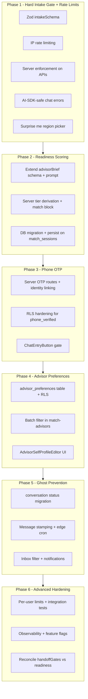

# TravelConnect Guardrails — Multi-Phase Plan (10/10)

## Full program (all phases)



| Phase | Goal | Key deliverable |
|-------|------|-----------------|
| **1** | Block impossible intake + bot spam | Zod validation, IP rate limits, server gates, AI-SDK-safe errors |
| **2** | Score lead intent | LLM readiness + server-enforced tier blocking |
| **3** | Stop anonymous connects | Phone OTP via server, not client-trust |
| **4** | Advisor control | Preference filtering with RLS |
| **5** | Clean advisor inbox | 48h auto-archive stale threads |
| **6** | Advanced ops | Per-user limits, integration tests, monitoring, rollout |

---

## Phase 1 — Server-Authoritative Hard Intake Gate

### Why Phase 1 first

The original guide puts validation only in the browser. Production requires a **single source of truth** enforced on **every API that consumes intake**, so bypassing the UI (direct `fetch`, URL deep-link to `?step=chat`) cannot trigger concierge LLM calls or advisor matching.

Phase 1 also adds **basic IP rate limiting** on unauthenticated LLM routes. Without it, valid payloads can still be spammed in a loop, triggering billing spikes and `match_sessions` pollution. Advanced per-user limits stay in Phase 6.

Phase 1 does **not** include readiness scoring, OTP, advisor prefs, or ghost cron — those are Phases 2–5.

### Product-aligned rules (not blind copy of guide)

| Rule | Guide said | Product reality | Phase 1 decision |
|------|-----------|-----------------|------------------|
| Budget floor | ₹1L | [`StepBudget.tsx`](advisor-profile/components/matching/StepBudget.tsx) `MIN_L = 5`, [`parseIntakeBody`](advisor-profile/lib/matchAdvisors.ts) clamps 5–50 | **₹5L minimum** via Zod `.min(5)` |
| Generic destination | `anywhere`, etc. | [`StepDestination.tsx`](advisor-profile/components/matching/StepDestination.tsx) has **"Surprise me"** | Block raw `Surprise me`; **region-picker UX** resolves to valid destination |
| Broad regions | Block generic words | Curated grid allows `Europe`, `Japan`, etc. | **Allow** curated regions |
| Timing | `"This week"`, `"In the next 3 days"` | [`StepLogistics.tsx`](advisor-profile/components/matching/StepLogistics.tsx) uses `Just dreaming` | Block **`Just dreaming`** via Zod `.refine()` |
| Travel style | Required | Already required by funnel | Enforce on server |

---

### 1. Zod-based validation (not manual if/else)

Use the project's existing **Zod** dependency (same pattern as [`lib/advisorBrief.ts`](advisor-profile/lib/advisorBrief.ts)) as the single validation engine. This eliminates the `parseIntakeBody` clamp-before-validate bug and removes boilerplate type-casting.

**New file:** [`advisor-profile/lib/guardrails/constants.ts`](advisor-profile/lib/guardrails/constants.ts)

- `MIN_BUDGET_LAKH = 5`, `MAX_BUDGET_LAKH = 50`
- `BLOCKED_DESTINATIONS` — `surprise me`, `anywhere`, `everywhere`, `somewhere`, `abroad`, `international`
- `BLOCKED_TIMINGS` — `Just dreaming`
- `SURPRISE_ME_REGIONS` — `['Europe', 'Southeast Asia', 'Japan']` (curated, validation-passing destinations)
- `MIN_DESTINATION_LENGTH = 3`

**New file:** [`advisor-profile/lib/intakeValidation.ts`](advisor-profile/lib/intakeValidation.ts)

```typescript
import { z } from 'zod'
import { MIN_BUDGET_LAKH, MAX_BUDGET_LAKH, BLOCKED_DESTINATIONS, BLOCKED_TIMINGS } from './guardrails/constants'

export const intakeSchema = z.object({
  destination: z.string().trim().min(MIN_DESTINATION_LENGTH, 'Please name a specific destination.'),
  budgetLakh: z.number().min(MIN_BUDGET_LAKH).max(MAX_BUDGET_LAKH),
  travelStyle: z.string().trim().min(1, 'Please select a travel style.'),
  vibe: z.string().trim().min(1),
  pace: z.string().trim().min(1),
  timing: z.string().trim().min(1),
  duration: z.string().trim().min(1),
}).superRefine((data, ctx) => {
  const dest = data.destination.toLowerCase()
  if (BLOCKED_DESTINATIONS.includes(dest)) {
    ctx.addIssue({ code: 'custom', path: ['destination'], message: '...' })
  }
  if (BLOCKED_TIMINGS.includes(data.timing)) {
    ctx.addIssue({ code: 'custom', path: ['timing'], message: '...' })
  }
})

export type IntakeValidationResult = {
  valid: boolean
  blockedField?: 'destination' | 'budget' | 'travelStyle' | 'timing'
  message?: string
  code?: 'INTAKE_BLOCKED'
}

/** Parse raw request body — no silent clamping. */
export function parseAndValidateIntake(body: unknown):
  | { success: true; data: MatchIntakePayload }
  | { success: false; result: IntakeValidationResult }

/** Validate an already-typed payload (client UI). */
export function validateIntake(payload: MatchIntakePayload): IntakeValidationResult
```

**Refactor [`parseIntakeBody`](advisor-profile/lib/matchAdvisors.ts):** Either delegate to `intakeSchema.safeParse` after coercing types, or deprecate in favor of `parseAndValidateIntake` in API routes. **Remove silent budget clamping** — let Zod reject `budgetLakh < 5` explicitly.

Map Zod `ZodError` issues to `IntakeValidationResult` via a small helper (`zodErrorToIntakeResult`) so API responses stay consistent.

**New file:** [`advisor-profile/lib/guardrails/intakeGate.ts`](advisor-profile/lib/guardrails/intakeGate.ts)

```typescript
export function rejectIfInvalidIntake(
  body: unknown,
  route: string,
): NextResponse | null  // 422 JSON if blocked, null if OK
```

Response shape (non-stream routes):

```json
{
  "blocked": true,
  "code": "INTAKE_BLOCKED",
  "blockedField": "destination",
  "message": "Please name a specific destination..."
}
```

Use **HTTP 422** for intake validation failures. Use **HTTP 429** for rate limit failures (see section 2).

---

### 2. IP rate limiting (Phase 1 — not deferred)

**Problem:** Public unauthenticated routes accept valid payloads in a loop, still triggering LLM calls and DB writes.

**New dependency:** `@upstash/ratelimit` + `@upstash/redis` (works on Vercel; no Vercel KV lock-in required).

**Env vars (document in README, never commit):**
- `UPSTASH_REDIS_REST_URL`
- `UPSTASH_REDIS_REST_TOKEN`

**New file:** [`advisor-profile/lib/guardrails/rateLimit.ts`](advisor-profile/lib/guardrails/rateLimit.ts)

```typescript
export async function checkRateLimit(
  request: Request,
  bucket: 'chat' | 'synthesize-brief' | 'match-advisors' | 'match-sessions',
): Promise<NextResponse | null>  // 429 if exceeded, null if OK
```

**Suggested limits (tune in production):**

| Route | Bucket | Limit | Rationale |
|-------|--------|-------|-----------|
| `/api/chat` | `chat` | 15 req / min / IP | Highest LLM cost |
| `/api/synthesize-brief` | `synthesize-brief` | 8 req / min / IP | LLM call on handoff |
| `/api/match-advisors` | `match-advisors` | 30 req / min / IP | Cheaper but rerank may call LLM |
| `/api/match-sessions` | `match-sessions` | 10 req / min / IP | DB write spam |

IP extraction: `x-forwarded-for` first hop (Vercel), fallback to `x-real-ip`, then `'anonymous'`.

429 response:

```json
{ "blocked": true, "code": "RATE_LIMITED", "message": "Too many requests. Please wait a moment." }
```

Include `Retry-After` header. Log: `console.warn('[rate-limit]', { route, bucket })` — no IP in logs (hash if needed for debugging).

**Middleware order in every route:** rate limit check → intake validation → business logic.

**Graceful degradation:** If Upstash env vars are missing in local dev, skip rate limiting with a `console.warn` once — do not block development. In production (`NODE_ENV=production`), fail closed or require env vars at build time.

Phase 6 adds per-user limits for authenticated routes, sliding windows per advisor, and dashboard alerting.

---

### 3. Server enforcement — route-specific error strategy

Wire guards at the **top** of each handler, **before** any LLM or DB work:

| Route | File | Intake invalid | Rate limited |
|-------|------|----------------|--------------|
| Concierge chat | [`app/api/chat/route.ts`](advisor-profile/app/api/chat/route.ts) | **Synthetic stream** (see 3a) | 429 JSON |
| Brief synthesis | [`app/api/synthesize-brief/route.ts`](advisor-profile/app/api/synthesize-brief/route.ts) | 422 JSON | 429 JSON |
| Advisor matching | [`app/api/match-advisors/route.ts`](advisor-profile/app/api/match-advisors/route.ts) | 422 JSON | 429 JSON |
| Session analytics | [`app/api/match-sessions/route.ts`](advisor-profile/app/api/match-sessions/route.ts) | 422 JSON | 429 JSON |

[`evaluateHandoffGate`](advisor-profile/lib/handoffGates.ts) stays unchanged — it gates **handoff intent**, not **intake validity**.

#### 3a. Vercel AI SDK — do NOT return bare 422 from `/api/chat`

**Problem:** [`StepAIConcierge.tsx`](advisor-profile/components/matching/StepAIConcierge.tsx) uses `useChat` + `DefaultChatTransport`. A hard HTTP 422 mid-stream causes a generic `"Failed to fetch"` / `error` from the hook — the user never sees `body.message`.

**Solution (server):** When intake is invalid on `POST /api/chat`, **do not call `streamText`**. Instead return a **synthetic UI message stream** using `createUIMessageStreamResponse` (AI SDK v6):

```typescript
// app/api/chat/route.ts — blocked intake path (no LLM call)
import { createUIMessageStreamResponse } from 'ai'

return createUIMessageStreamResponse({
  stream: createUIMessageStream({
    execute: ({ writer }) => {
      writer.write({
        type: 'text-delta',
        delta: 'I need a specific destination before we can plan your trip. Please go back and pick a region.',
        id: 'intake-blocked',
      })
      writer.write({ type: 'finish' })
    },
  }),
  headers: {
    'X-Intake-Blocked': 'true',
    'X-Intake-Blocked-Field': blockedField,
  },
})
```

This keeps the `useChat` transport contract intact, costs zero LLM tokens, and surfaces a readable assistant message in the chat thread.

**Solution (client):** In [`StepAIConcierge.tsx`](advisor-profile/components/matching/StepAIConcierge.tsx):

1. Add `onError` to `useChat` for **429** and unexpected failures — parse JSON body when `error.message` contains status info, or use a custom `fetch` wrapper in `DefaultChatTransport` if needed.
2. After each assistant message completes, check response headers (expose via custom transport `fetch` wrapper that stores `X-Intake-Blocked` on the transport instance) **OR** detect the known intake-blocked message id prefix.
3. When blocked: render an **"Edit trip details"** button that calls `onBack()` — do not leave the user stuck in a broken chat.

For **429 on chat**: `onError` shows "You're sending messages too quickly" with a retry hint. No stream expected.

**Non-stream routes** (`synthesize-brief`, `match-advisors`, `match-sessions`) continue to use **422 JSON** — standard `fetch` error handling applies.

---

### 4. Client UX — both funnels

#### A. `/start` funnel — [`app/start/page.tsx`](advisor-profile/app/start/page.tsx)

- Import `validateIntake`
- Add `intakeError` state
- In `StepTravelStyle` `onNext`: build full `MatchIntakePayload`, call `validateIntake`, show error inline, **do not** `goTo('chat')` if invalid
- Defensive guard: `currentStep === 3 && intakePayload && validateIntake(intakePayload).valid`

#### B. `/` home funnel — [`app/page.tsx`](advisor-profile/app/page.tsx)

- Validate before advancing from `StepPreferences` to concierge
- Defensive guard before rendering `StepAIConcierge`
- Inline error on preferences step

#### C. API error handling in UI

[`StepMatching.tsx`](advisor-profile/components/matching/StepMatching.tsx) `fetchMatches`:

```typescript
if (res.status === 422) { /* surface body.message, navigate back */ }
if (res.status === 429) { /* show rate limit message, optional retry */ }
```

[`StepAIConcierge.tsx`](advisor-profile/components/matching/StepAIConcierge.tsx): synthetic stream handling + `onError` for 429 (see section 3a).

---

### 5. "Surprise me" — region-picker branch (keep conversion, pass validation)

**Do not remove** the "Surprise me" tile — it may be part of ad creative ("Don't know where to go?").

**Change in [`StepDestination.tsx`](advisor-profile/components/matching/StepDestination.tsx):**

When user taps **"Surprise me"**, transition to an inline sub-step (no new funnel page required):

```
┌─────────────────────────────────────┐
│  Not sure yet? Pick a region:       │
│  [ Europe ] [ Southeast Asia ] [ Japan ] │
│  ← Back to all destinations         │
└─────────────────────────────────────┘
```

- Options from `SURPRISE_ME_REGIONS` in `constants.ts` — all pass `intakeSchema`
- On pick: call `onNext(selectedRegion)` as if they chose that tile directly
- On back: return to main destination grid
- **Never** pass the literal string `"Surprise me"` to `onNext` or sessionStorage

This preserves marketing UX while ensuring server validation always receives a concrete region.

---

### 6. Tests

**New file:** [`advisor-profile/__tests__/intakeValidation.test.ts`](advisor-profile/__tests__/intakeValidation.test.ts)

| Case | Expected |
|------|----------|
| Blank destination | `blockedField: destination` |
| `"Surprise me"` | blocked |
| `"anywhere"` | blocked |
| `"Japan"` | valid |
| `"Europe"` | valid |
| Budget 4.5L | blocked |
| Budget 5L | valid |
| Missing travel style | blocked |
| Timing `"Just dreaming"` | blocked |
| Full valid payload | `valid: true` |
| Raw body with string budget `"15"` | coerced + valid (if coercion added to schema) |

**New file:** [`advisor-profile/__tests__/intakeGateApi.test.ts`](advisor-profile/__tests__/intakeGateApi.test.ts)

- `rejectIfInvalidIntake` returns 422 with correct shape
- `zodErrorToIntakeResult` maps paths correctly
- Rate limit helper returns 429 shape (mock Upstash in tests)

---

### 7. Files touched (Phase 1 only)

| Action | File |
|--------|------|
| **Create** | `lib/guardrails/constants.ts` |
| **Create** | `lib/intakeValidation.ts` (Zod schema + parsers) |
| **Create** | `lib/guardrails/intakeGate.ts` |
| **Create** | `lib/guardrails/rateLimit.ts` |
| **Edit** | `lib/matchAdvisors.ts` (remove silent clamp; align with schema) |
| **Edit** | `app/api/chat/route.ts` (rate limit + synthetic stream on blocked intake) |
| **Edit** | `app/api/synthesize-brief/route.ts` |
| **Edit** | `app/api/match-advisors/route.ts` |
| **Edit** | `app/api/match-sessions/route.ts` |
| **Edit** | `app/start/page.tsx` |
| **Edit** | `app/page.tsx` |
| **Edit** | `components/matching/StepAIConcierge.tsx` (blocked stream + onError 429) |
| **Edit** | `components/matching/StepMatching.tsx` (422/429 handling) |
| **Edit** | `components/matching/StepDestination.tsx` (Surprise me region picker) |
| **Add dep** | `@upstash/ratelimit`, `@upstash/redis` in `package.json` |
| **Create** | `__tests__/intakeValidation.test.ts` |
| **Create** | `__tests__/intakeGateApi.test.ts` |

**Not in Phase 1:** migrations, OTP, readiness schema, edge functions, `ChatEntryButton`, `AdvisorSelfProfileEditor`.

---

### 8. Phase 1 acceptance criteria

- [ ] Invalid intake cannot reach concierge LLM (verified: bad body → synthetic stream, no `streamText` call)
- [ ] Invalid intake cannot trigger matching (`POST /api/match-advisors` → 422)
- [ ] Invalid intake cannot be persisted to `match_sessions`
- [ ] Rate limit triggers 429 before LLM on all 4 routes (verified with burst test)
- [ ] Both `/start` and `/` funnels show inline errors and block step advancement
- [ ] `?step=chat` deep-link cannot render concierge with invalid session intake
- [ ] "Surprise me" shows region picker; selected region passes validation
- [ ] Chat UI shows readable blocked message + "Edit trip details" — not generic fetch error
- [ ] All unit tests pass (`npm test`)
- [ ] No client-only security assumptions

---

### 9. Estimated effort

| Task | Time |
|------|------|
| Zod schema + constants + refactor parseIntakeBody | 1.5h |
| Rate limit module + Upstash setup | 1.5h |
| Server wiring (4 routes, chat synthetic stream) | 2h |
| Client wiring (2 funnels + StepAIConcierge + StepMatching) | 2h |
| Surprise me region picker | 1h |
| Tests | 1.5h |
| **Total Phase 1** | **~9–10h** |

---

### 10. What Phase 2 will build on

Phase 1 establishes `lib/guardrails/` as the home for all guardrail logic. Phase 2 adds:
- `readiness_score` / `readiness_tier` to [`lib/advisorBrief.ts`](advisor-profile/lib/advisorBrief.ts) (Zod, same pattern)
- Server-side tier derivation (score → tier, never trust client tier alone)
- `blocked` tier rejection in `match-advisors`
- Migration `20250612120000_match_sessions_readiness.sql`
- Badge in [`components/AdvisorBriefPanel.tsx`](advisor-profile/components/AdvisorBriefPanel.tsx)

Phase 6 shifts to **advanced** hardening only: per-user rate limits, integration tests against live routes, observability dashboards, feature flags.
