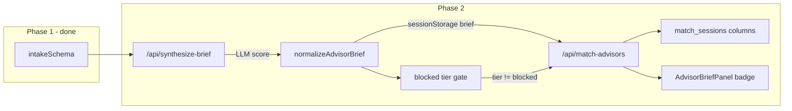

# Phase 2 — LLM Readiness Scoring and Server-Enforced Tier Gating

## Context (what Phase 1 already provides)

Phase 1 established [`lib/guardrails/`](advisor-profile/lib/guardrails/) with Zod intake validation, rate limits, and 422/429 enforcement on all funnel APIs. Phase 2 adds a **second guardrail layer** after the concierge chat: scoring booking intent before advisors are matched.



**Relationship to existing handoff gates:** [`lib/handoffGates.ts`](advisor-profile/lib/handoffGates.ts) already blocks concierge handoff until confidence, intent, and turn-count thresholds pass ([`app/api/chat/route.ts`](advisor-profile/app/api/chat/route.ts)). Readiness scoring is **complementary** — it evaluates the full chat transcript at brief synthesis time and can still block low-intent leads that slipped through (e.g. explicit override path).

---

## Goals

1. LLM outputs `readiness_score` (0–100), `low_intent_signals`, and a provisional `readiness_tier` in the advisor brief
2. **Server always re-derives tier from score** — client/LLM tier drift is ignored for gating
3. `blocked` tier returns empty advisors (HTTP 200 + `blocked: true`) — no wasted rerank LLM cost
4. `nurture` tier still matches but is tagged in the API response for UI treatment
5. Scores persist on `match_sessions` for analytics
6. Advisors see tier badge + score in [`AdvisorBriefPanel.tsx`](advisor-profile/components/AdvisorBriefPanel.tsx)

**Explicitly out of scope (Phase 3–4):** Phone OTP gate, `advisor_preferences` filtering, nurture opt-in per advisor.

---

## 1. Extend brief schema and fallback

**Edit:** [`advisor-profile/lib/advisorBrief.ts`](advisor-profile/lib/advisorBrief.ts)

Add Zod fields (same pattern as existing schema):

```typescript
export const readinessTierSchema = z.enum(['hot', 'warm', 'nurture', 'blocked'])
export type ReadinessTier = z.infer<typeof readinessTierSchema>

// Add to advisorBriefSchema:
readiness_score: z.number().int().min(0).max(100),
readiness_tier: readinessTierSchema,
low_intent_signals: z.array(z.string()).max(3),
```

Update [`buildFallbackBrief`](advisor-profile/lib/advisorBrief.ts) defaults:

- `readiness_score: 50`
- `readiness_tier: 'warm'` (will be re-derived by normalizer)
- `low_intent_signals: []`

**Important:** Any code using `advisorBriefSchema.parse` (session restore, conversation briefs) will automatically require the new fields once deployed. The normalizer ensures backward-compatible defaults when parsing old session JSON.

---

## 2. Server-authoritative readiness module

**New file:** [`advisor-profile/lib/guardrails/readiness.ts`](advisor-profile/lib/guardrails/readiness.ts)

Pure functions — no LLM calls:

| Function | Purpose |
|----------|---------|
| `deriveReadinessTier(score: number): ReadinessTier` | 75+ hot, 50–74 warm, 35–49 nurture, 0–34 blocked |
| `clampReadinessScore(score: number): number` | Round + clamp 0–100 |
| `estimateReadinessCeiling(intake, transcriptTurnCount?)` | Deterministic cap on score from intake quality (mitigates client brief spoofing) |
| `normalizeAdvisorBrief(brief, intake?, transcriptTurnCount?): AdvisorBrief` | Clamp score, apply ceiling, **overwrite tier from score** |

**Ceiling heuristic (lightweight anti-spoofing):** Without re-calling the LLM, cap the effective score when intake/chat evidence is thin:

- No brief / missing chat context: ceiling **55** (warm max)
- Broad region-only destination (e.g. `Europe`, `Southeast Asia`) with no city in transcript: ceiling **65**
- Fewer than 3 user turns in transcript (when available): ceiling **60**
- Client cannot inflate to `hot` without passing ceiling checks

This does not eliminate all spoofing (a crafted brief could still send score 65), but prevents trivial `readiness_score: 100` bypass. Full fix (server-side brief cache keyed to session) stays in Phase 6.

**Constants:** Add tier thresholds to [`lib/guardrails/constants.ts`](advisor-profile/lib/guardrails/constants.ts):

```typescript
export const READINESS_TIER_THRESHOLDS = { hot: 75, warm: 50, nurture: 35 } as const
```

---

## 3. Synthesize-brief — LLM scoring + normalization

**Edit:** [`advisor-profile/app/api/synthesize-brief/route.ts`](advisor-profile/app/api/synthesize-brief/route.ts)

After Phase 1 guards (rate limit → intake validation):

1. Append readiness scoring section to the `generateObject` prompt (signal rubric from original guide, **minus OTP references** — OTP is Phase 3; use "start from 50 baseline" instead)
2. After `generateObject` **and** in `buildFallbackBrief` path: call `normalizeAdvisorBrief(brief, intake, userTurnCount)`
3. Return normalized brief in JSON response

`userTurnCount` = count of `role === 'user'` messages in request body (same as handoff gate).

Log structured event (no PII):

```typescript
console.info('[readiness-score]', { route: '/api/synthesize-brief', tier, score })
```

---

## 4. Match-advisors — tier gating (server enforced)

**Edit:** [`advisor-profile/app/api/match-advisors/route.ts`](advisor-profile/app/api/match-advisors/route.ts)

After intake validation, before `matchAgencies`:

```typescript
const rawBrief = /* parse advisorBrief from body via advisorBriefSchema, or null */
const advisorBrief = rawBrief
  ? normalizeAdvisorBrief(rawBrief, intake)
  : null

const readinessScore = advisorBrief?.readiness_score ?? 50
const readinessTier = deriveReadinessTier(readinessScore) // never trust client tier

if (readinessTier === 'blocked') {
  return NextResponse.json({
    advisors: [],
    blocked: true,
    code: 'READINESS_BLOCKED',
    blockReason: '...',
    readinessTier,
    readinessScore,
    lowIntentSignals: advisorBrief?.low_intent_signals ?? [],
  }, { status: 200 })
}
```

Then run existing `matchAgencies` + `rerankWithLlm` only for non-blocked leads.

Extend success response:

```typescript
{
  advisors: enriched,
  readinessTier,
  readinessScore,
  isNurtureLead: readinessTier === 'nurture',
  lowIntentSignals: advisorBrief?.low_intent_signals ?? [],
  // ...existing fields
}
```

**Also edit:** [`advisor-profile/app/api/match-advisors/local/route.ts`](advisor-profile/app/api/match-advisors/local/route.ts) — same normalization + blocked gate for dev parity.

---

## 5. Client — match fetch and results UI

**Edit:** [`advisor-profile/lib/guardrails/matchFetch.ts`](advisor-profile/lib/guardrails/matchFetch.ts)

Extend response handling:

```typescript
type MatchResponse = {
  advisors?: EnrichedMatchedAdvisor[]
  blocked?: boolean
  code?: 'READINESS_BLOCKED'
  blockReason?: string
  readinessTier?: ReadinessTier
  readinessScore?: number
  isNurtureLead?: boolean
}
```

- If `blocked === true` → throw new `MatchGuardrailError` with code `READINESS_BLOCKED` (distinct from `INTAKE_BLOCKED`)
- Return `readinessTier` / `isNurtureLead` metadata alongside advisors for UI (extend return type or pass via callback)

**Edit:** [`advisor-profile/components/matching/StepMatching.tsx`](advisor-profile/components/matching/StepMatching.tsx)

- Handle `READINESS_BLOCKED` via `onGuardrailBlocked` (reuse existing callback — navigate back to concierge with message)
- Pass readiness metadata to `onComplete` (extend callback signature or store in parent state)

**Edit:** [`advisor-profile/app/start/page.tsx`](advisor-profile/app/start/page.tsx) and [`advisor-profile/app/page.tsx`](advisor-profile/app/page.tsx)

- Track `readinessTier` / `isNurtureLead` in state from match response
- Pass to `StepResults` for conditional copy

**Edit:** [`advisor-profile/components/matching/StepResults.tsx`](advisor-profile/components/matching/StepResults.tsx)

- New optional props: `readinessTier`, `isNurtureLead`
- Nurture: subtle banner ("We'll connect you when you're closer to booking") — advisors still shown
- Blocked path handled by StepMatching redirect (results step never reached)

---

## 6. Advisor-facing UI

**Edit:** [`advisor-profile/components/AdvisorBriefPanel.tsx`](advisor-profile/components/AdvisorBriefPanel.tsx)

Add tier badge above `tldr`:

| Tier | Label | Style |
|------|-------|-------|
| hot | Hot lead | green badge |
| warm | Warm lead | yellow badge |
| nurture | Nurture | gray badge |
| blocked | (should not reach advisor UI) | — |

Show `Readiness: {score}/100` and optional `low_intent_signals` bullets (collapsed, max 3).

[`ClientBriefOverlay.tsx`](advisor-profile/components/chat/ClientBriefOverlay.tsx) already renders `AdvisorBriefPanel` — no separate `ClientBriefPanel` file exists.

---

## 7. Database migration and persistence

**New migration:** [`advisor-profile/supabase/migrations/20250612120000_match_sessions_readiness.sql`](advisor-profile/supabase/migrations/20250612120000_match_sessions_readiness.sql)

```sql
ALTER TABLE public.match_sessions
  ADD COLUMN IF NOT EXISTS readiness_score smallint DEFAULT 50
    CHECK (readiness_score BETWEEN 0 AND 100),
  ADD COLUMN IF NOT EXISTS readiness_tier text DEFAULT 'warm'
    CHECK (readiness_tier IN ('hot', 'warm', 'nurture', 'blocked')),
  ADD COLUMN IF NOT EXISTS low_intent_signals text[] DEFAULT '{}';
```

**Edit:** [`advisor-profile/app/api/match-sessions/route.ts`](advisor-profile/app/api/match-sessions/route.ts)

- Accept optional `advisorBrief` in request body (or separate `readinessScore` / `readinessTier` fields)
- Normalize before insert; persist `readiness_score`, `readiness_tier`, `low_intent_signals` on the row
- Do **not** notify advisors via push for `blocked` tier (skip `notifyMatchedAdvisors` when tier is blocked)

**Edit:** [`advisor-profile/lib/supabase/database.types.ts`](advisor-profile/lib/supabase/database.types.ts) — add new columns to `match_sessions` Row/Insert types.

**Edit:** [`advisor-profile/app/start/page.tsx`](advisor-profile/app/start/page.tsx) `saveMatchSession` — include readiness fields from `advisorBrief` in POST body.

---

## 8. Tests

**New file:** [`advisor-profile/__tests__/readiness.test.ts`](advisor-profile/__tests__/readiness.test.ts)

| Case | Expected |
|------|----------|
| `deriveReadinessTier(80)` | `hot` |
| `deriveReadinessTier(50)` | `warm` |
| `deriveReadinessTier(40)` | `nurture` |
| `deriveReadinessTier(20)` | `blocked` |
| `normalizeAdvisorBrief` ignores LLM tier mismatch | tier recalculated from score |
| Ceiling caps inflated client score | score clamped down |
| `buildFallbackBrief` + normalize | valid warm defaults |

**Extend:** [`advisor-profile/__tests__/intakeGateApi.test.ts`](advisor-profile/__tests__/intakeGateApi.test.ts) or new `matchAdvisorsReadiness.test.ts` — unit-test blocked response shape from a extracted pure helper (avoid full Next.js route integration in Phase 2).

---

## 9. Files touched (summary)

| Action | File |
|--------|------|
| **Create** | `lib/guardrails/readiness.ts` |
| **Edit** | `lib/guardrails/constants.ts` |
| **Edit** | `lib/advisorBrief.ts` |
| **Edit** | `app/api/synthesize-brief/route.ts` |
| **Edit** | `app/api/match-advisors/route.ts` |
| **Edit** | `app/api/match-advisors/local/route.ts` |
| **Edit** | `app/api/match-sessions/route.ts` |
| **Edit** | `lib/guardrails/matchFetch.ts` |
| **Edit** | `components/matching/StepMatching.tsx` |
| **Edit** | `components/matching/StepResults.tsx` |
| **Edit** | `components/AdvisorBriefPanel.tsx` |
| **Edit** | `app/start/page.tsx`, `app/page.tsx` |
| **Create** | `supabase/migrations/20250612120000_match_sessions_readiness.sql` |
| **Edit** | `lib/supabase/database.types.ts` |
| **Create** | `__tests__/readiness.test.ts` |

---

## 10. Acceptance criteria

- [ ] `synthesize-brief` returns brief with `readiness_score`, `readiness_tier`, `low_intent_signals`
- [ ] Server overwrites LLM tier when it disagrees with score
- [ ] `POST /api/match-advisors` with `readiness_score: 20` returns `{ blocked: true, advisors: [] }` without calling `rerankWithLlm`
- [ ] Client cannot set `readiness_tier: 'hot'` with `readiness_score: 10` — server uses derived tier
- [ ] Inflated client score is capped by ceiling heuristic
- [ ] `match_sessions` rows include readiness columns after migration
- [ ] Advisor brief panel shows tier badge + score
- [ ] Nurture leads see differentiated copy on results; warm/hot see standard flow
- [ ] All tests pass (`npm test`)

---

## 11. Estimated effort

| Task | Time |
|------|------|
| Schema + readiness module + constants | 1.5h |
| synthesize-brief prompt + normalization | 1.5h |
| match-advisors gating + local route | 1.5h |
| match-sessions migration + persistence | 1h |
| Client (matchFetch, StepMatching, StepResults, funnels) | 2h |
| AdvisorBriefPanel badge | 45min |
| Tests | 1.5h |
| **Total Phase 2** | **~10h** |

---

## 12. What Phase 3 builds on

Phase 3 adds phone OTP before connect. The original guide tied OTP to readiness scoring (+10 for verified) — once OTP ships, extend `estimateReadinessCeiling` or the synthesize prompt to include verification bonus. Phase 4 adds `advisor_preferences.accept_nurture_leads` to filter nurture-tier leads per advisor.
