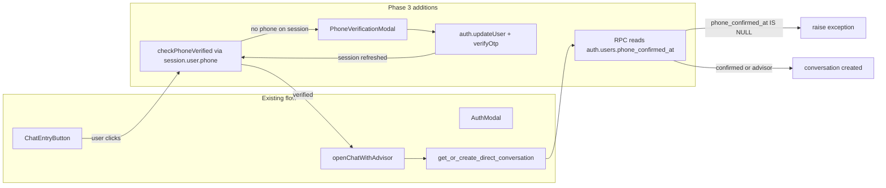

# Phase 3 — Phone OTP Gate Before Advisor Connect

## Context

Phases 1–2 established intake validation, readiness scoring, and tier-based gating. Phase 3 adds **identity verification**: a traveller must verify their phone number via SMS OTP before opening a chat with any advisor.

**Key constraint:** Users are already authenticated (email/Google via [components/auth/AuthModal.tsx](advisor-profile/components/auth/AuthModal.tsx)). Phone OTP is an *additional* verification step on the existing session — not a new sign-in method. Flow: `updateUser({ phone })` → SMS OTP → `verifyOtp({ type: 'phone_change' })`.

### Security principle (critical)

**Never store or check `phone_verified` on `public.users`.** The existing RLS policy `"Users can update own profile"` allows authenticated clients to UPDATE their own row. If `phone_verified` lived on `public.users`, a malicious user could bypass OTP in seconds:

```javascript
await supabase.from('users').update({ phone_verified: true }).eq('id', my_uid)
```

**Source of truth:** Supabase Auth's secure `auth.users` table — specifically `phone` and `phone_confirmed_at`. Clients cannot write these; only `verifyOtp` succeeds server-side.



---

## 1. Database migration (RPC only — no verification columns on public.users)

**New file:** [advisor-profile/supabase/migrations/20250615120000_phone_verification.sql](advisor-profile/supabase/migrations/20250615120000_phone_verification.sql)

**Do NOT add** `phone`, `phone_verified`, or `phone_verified_at` to `public.users`. Verification state stays in `auth.users` only.

Update `get_or_create_direct_conversation` (SECURITY DEFINER — can read `auth.users`):

```sql
CREATE OR REPLACE FUNCTION public.get_or_create_direct_conversation(peer_user_id uuid)
RETURNS uuid
LANGUAGE plpgsql
SECURITY DEFINER
SET search_path = public
AS $$
DECLARE
  existing_id uuid;
  new_id uuid;
  caller_role text;
  caller_phone_confirmed timestamptz;
BEGIN
  IF auth.uid() IS NULL THEN
    RAISE EXCEPTION 'Not authenticated';
  END IF;

  IF peer_user_id IS NULL OR peer_user_id = auth.uid() THEN
    RAISE EXCEPTION 'Invalid peer user';
  END IF;

  -- Travellers must have a phone confirmed in Supabase Auth (not spoofable via public.users RLS)
  SELECT account_role INTO caller_role
  FROM public.users WHERE id = auth.uid();

  IF caller_role = 'traveller' THEN
    SELECT phone_confirmed_at INTO caller_phone_confirmed
    FROM auth.users WHERE id = auth.uid();

    IF caller_phone_confirmed IS NULL THEN
      RAISE EXCEPTION 'Phone verification required to connect with an advisor';
    END IF;
  END IF;

  -- ... existing ensure_public_user + find/create conversation logic unchanged ...
END;
$$;
```

**Advisors** (`account_role = 'advisor'`) skip the phone gate — they initiate chats from their inbox, not the match funnel.

**No new RLS policies** for verification fields. Do not widen `"Users can update own profile"` to cover auth state.

---

## 2. Phone verification library

**New file:** [advisor-profile/lib/phoneVerification.ts](advisor-profile/lib/phoneVerification.ts)

Pure helpers + thin Supabase Auth wrappers:

| Function | Behavior |
|----------|----------|
| `normalizePhoneE164(phone: string)` | Strip non-digits; default `+91` for 10-digit India; require valid E.164 |
| `sendPhoneOtp(phone: string)` | `supabase.auth.updateUser({ phone: normalized })` — triggers SMS |
| `verifyPhoneOtp(phone: string, token: string)` | `supabase.auth.verifyOtp({ phone, token, type: 'phone_change' })` — **no** `public.users` update on success; Auth refreshes session JWT with `user.phone` |
| `checkPhoneVerified()` | Read active session only: `const { data: { session } } = await supabase.auth.getSession()` → `{ verified: !!session?.user?.phone, phone: session?.user?.phone ?? null }` |

**Why session, not DB:** After `verifyOtp`, Supabase updates the session user object. Checking `session.user.phone` is faster, avoids an extra round-trip, and cannot be spoofed via `public.users` RLS.

**Input validation:** Reject phones with fewer than 10 digits; never log full phone numbers (structured log with last 4 digits only if needed).

---

## 3. Phone verification modal

**New file:** [advisor-profile/components/matching/PhoneVerificationModal.tsx](advisor-profile/components/matching/PhoneVerificationModal.tsx)

Two-stage modal (portal pattern from [AuthModal.tsx](advisor-profile/components/auth/AuthModal.tsx)):

- **Stage 1 — Phone:** tel input, "Send verification code" → `sendPhoneOtp`
- **Stage 2 — OTP:** 6-digit input, "Confirm and connect" → `verifyPhoneOtp`; on success call `onVerified()` (parent re-reads session)
- Props: `onVerified: () => void`, `onDismiss: () => void`
- Copy: number is for lead quality, never shared with advisors in raw form

---

## 4. Client-side gate in ChatEntryButton

**Edit:** [advisor-profile/components/chat/ChatEntryButton.tsx](advisor-profile/components/chat/ChatEntryButton.tsx)

Gate order: **auth → phone → chat**

1. Existing: no session → `AuthModal`
2. **New:** session but `!session.user.phone` → `PhoneVerificationModal`
3. Verified → `openChatWithAdvisor` → navigate

Implementation:

- Preload: when `session` exists, `checkPhoneVerified()` (session-based)
- `onVerified` from modal: `await supabase.auth.getSession()` refresh, set local `phoneVerified`, resume `startChat()`
- Subscribe to `onAuthStateChange` so phone appears on session after OTP without full page reload

All "Chat with [Name]" entry points use `ChatEntryButton` — no separate `StepResults` changes required.

---

## 5. Server-side gate in openChatWithAdvisor

**Edit:** [advisor-profile/lib/chat/conversations.ts](advisor-profile/lib/chat/conversations.ts)

Extend return type:

```typescript
| { ok: false; reason: 'phone_not_verified' }
```

**Client pre-check (UX only):** If `!session.user.phone`, return `phone_not_verified` before RPC — avoids unnecessary call.

**Authoritative check:** RPC reads `auth.users.phone_confirmed_at`. Catch exception message containing `Phone verification required` and map to `phone_not_verified`.

`ChatEntryButton` handles `phone_not_verified` by opening the modal (belt-and-suspenders with step 4).

---

## 6. Readiness ceiling boost (Phase 2 integration)

**Edit:** [advisor-profile/lib/guardrails/readiness.ts](advisor-profile/lib/guardrails/readiness.ts)

Extend `estimateReadinessCeiling(intake?, transcriptTurnCount?, phoneVerified?)` — when `phoneVerified === true`, raise ceiling by **+10** (cap 100). Forward through `normalizeAdvisorBrief`.

**Edit:** [advisor-profile/app/api/synthesize-brief/route.ts](advisor-profile/app/api/synthesize-brief/route.ts)

When request has an authenticated session (optional — user may synthesize before sign-in):

```typescript
const supabase = await createServerClient()
const { data: { user } } = await supabase.auth.getUser()
const phoneVerified = Boolean(user?.phone)
// pass to normalizeAdvisorBrief(...)
```

Use Auth user phone, not `public.users`.

---

## 7. SMS rate limiting (production prerequisite)

OTP endpoints are targets for **SMS pumping / toll fraud**. Before production:

1. Configure **Supabase Auth → Rate Limits** for SMS/OTP sends (per IP, per phone, per hour)
2. Enable captcha on auth if available for your plan
3. Monitor Twilio/MessageBird spend alerts
4. Document env/dashboard steps in a short comment in `phoneVerification.ts` or project README section (no new markdown file unless requested)

Supabase built-in auth rate limits apply; explicit dashboard tuning is required for production.

---

## 8. Tests

**New file:** [advisor-profile/__tests__/phoneVerification.test.ts](advisor-profile/__tests__/phoneVerification.test.ts)

| Case | Expected |
|------|----------|
| `normalizePhoneE164('9876543210')` | `+919876543210` |
| `normalizePhoneE164('+919876543210')` | unchanged |
| Invalid / too short | throws or returns error shape |
| `isPhoneVerifiedFromSession({ user: { phone: '+91...' } })` | `true` |
| `isPhoneVerifiedFromSession({ user: {} })` | `false` |
| `estimateReadinessCeiling(..., phoneVerified: true)` | ceiling +10 vs false |

Extract `isPhoneVerifiedFromSession(user)` as a pure helper for unit tests. Full `verifyOtp` integration requires live Supabase — document manual test steps in test file comments.

---

## 9. Files touched (summary)

| Action | File |
|--------|------|
| **Create** | `supabase/migrations/20250615120000_phone_verification.sql` (RPC only) |
| **Create** | `lib/phoneVerification.ts` |
| **Create** | `components/matching/PhoneVerificationModal.tsx` |
| **Edit** | `components/chat/ChatEntryButton.tsx` |
| **Edit** | `lib/chat/conversations.ts` |
| **Edit** | `lib/guardrails/readiness.ts` |
| **Edit** | `app/api/synthesize-brief/route.ts` (optional session phone boost) |
| **Create** | `__tests__/phoneVerification.test.ts` |

**Removed from original plan:** `public.users` phone/verification columns, `database.types.ts` verification fields, client DB writes after OTP.

---

## 10. Acceptance criteria

- [ ] Unauthenticated user → `AuthModal` (unchanged)
- [ ] Authenticated traveller without `session.user.phone` → `PhoneVerificationModal`
- [ ] After successful OTP → session has `user.phone`, chat opens automatically
- [ ] Verified traveller → chat opens with no modal
- [ ] Advisors never phone-gated
- [ ] **Console spoof test fails:** `supabase.from('users').update({ phone_verified: true })` has no effect (column does not exist); RPC still blocks without `auth.users.phone_confirmed_at`
- [ ] PG RPC rejects unverified travellers even if client skips modal
- [ ] `checkPhoneVerified()` uses session only — no `public.users` verification query
- [ ] Readiness ceiling +10 when Auth session has verified phone (synthesize-brief path)
- [ ] SMS rate limits documented for production
- [ ] All tests pass (`npm test`)

---

## 11. Estimated effort

| Task | Time |
|------|------|
| RPC migration (auth.users gate) | 45min |
| phoneVerification.ts + session helpers | 1h |
| PhoneVerificationModal | 1.5h |
| ChatEntryButton + conversations.ts gates | 1h |
| Readiness boost (synthesize-brief session) | 30min |
| Tests + manual OTP checklist | 1h |
| **Total Phase 3** | **~5.5h** |

---

## 12. What Phase 4 builds on

Phase 4 adds `advisor_preferences` filtering (`min_readiness_score`, `accept_nurture_leads`). Phone-verified travellers may score higher via ceiling boost; advisor prefs then filter at match time.
