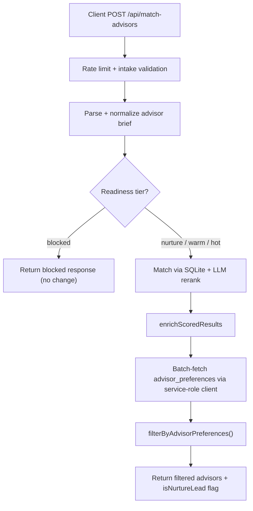

# Phase 4 -- Advisor Preference Controls

## Summary

Advisors gain a self-service "Lead preferences" panel where they set a minimum readiness score, a budget floor, and whether they accept nurture-tier leads. Both match-advisors routes enforce these preferences server-side after matching, using the service-role Supabase client (same pattern as `match-sessions/route.ts`). Nurture-tier leads are **unblocked** at the route level and instead filtered per-advisor via `accept_nurture_leads`.

---

## Data Flow (after Phase 4)



---

## Step 1 -- Database migration

Create `supabase/migrations/20250615180000_advisor_preferences.sql`:

```sql
CREATE TABLE IF NOT EXISTS public.advisor_preferences (
  user_id    uuid        PRIMARY KEY REFERENCES public.users(id) ON DELETE CASCADE,
  min_readiness_score smallint NOT NULL DEFAULT 35
    CHECK (min_readiness_score BETWEEN 0 AND 100),
  min_budget_lakh     numeric(6,2) NOT NULL DEFAULT 0
    CHECK (min_budget_lakh >= 0),
  accept_nurture_leads boolean NOT NULL DEFAULT false,
  active_destinations  text[]  NOT NULL DEFAULT '{}',
  updated_at timestamptz NOT NULL DEFAULT now()
);

ALTER TABLE public.advisor_preferences ENABLE ROW LEVEL SECURITY;

-- Advisors can read + write their own row
CREATE POLICY "Advisors manage own preferences"
  ON public.advisor_preferences FOR ALL
  TO authenticated
  USING (user_id = auth.uid())
  WITH CHECK (user_id = auth.uid());
```

Key points:
- `user_id` is `uuid` (matches `users.id` type) -- the original guide used `text` which is wrong for this schema.
- RLS restricts client-side access to own row only.
- Server-side match routes use the service-role client (bypasses RLS) to batch-read all matched advisors' preferences.
- `active_destinations` is included in the schema for future use but not filtered on in this phase.

Update [advisor-profile/lib/supabase/database.types.ts](advisor-profile/lib/supabase/database.types.ts) with the new `advisor_preferences` table type.

---

## Step 2 -- Create `lib/advisorPreferences.ts` (client-side CRUD)

New file: [advisor-profile/lib/advisorPreferences.ts](advisor-profile/lib/advisorPreferences.ts)

Provides types and client-side helpers used by the advisor editor UI:

```typescript
import { createClient } from '@/lib/supabase/client'

export interface AdvisorPreferences {
  min_readiness_score: number
  min_budget_lakh: number
  active_destinations: string[]
  accept_nurture_leads: boolean
}

export const ADVISOR_PREF_DEFAULTS: AdvisorPreferences = {
  min_readiness_score: 35,
  min_budget_lakh: 0,
  active_destinations: [],
  accept_nurture_leads: false,
}

export async function getAdvisorPreferences(userId: string): Promise<AdvisorPreferences> {
  const supabase = createClient()
  const { data } = await supabase
    .from('advisor_preferences')
    .select('min_readiness_score, min_budget_lakh, active_destinations, accept_nurture_leads')
    .eq('user_id', userId)
    .single()
  return data ?? { ...ADVISOR_PREF_DEFAULTS }
}

export async function saveAdvisorPreferences(
  userId: string,
  prefs: Partial<AdvisorPreferences>,
): Promise<{ error: string | null }> {
  const supabase = createClient()
  const { error } = await supabase.from('advisor_preferences').upsert({
    user_id: userId,
    ...prefs,
    updated_at: new Date().toISOString(),
  })
  return { error: error?.message ?? null }
}
```

---

## Step 3 -- Create `lib/guardrails/advisorPreferenceFilter.ts` (server-side filter)

New file: [advisor-profile/lib/guardrails/advisorPreferenceFilter.ts](advisor-profile/lib/guardrails/advisorPreferenceFilter.ts)

Keeps the server-side enforcement logic in the `guardrails/` folder, consistent with `intakeGate.ts`, `readiness.ts`, etc.

```typescript
import { createClient } from '@supabase/supabase-js'
import type { EnrichedMatchedAdvisorV2 } from '@/lib/enrichResults'
import type { ReadinessTier } from '@/lib/guardrails/readiness'

interface AdvisorPrefRow {
  user_id: string
  min_readiness_score: number
  min_budget_lakh: number
  accept_nurture_leads: boolean
}

// Reuse the existing service-role pattern from match-sessions/route.ts
const supabaseAdmin = createClient(
  process.env.NEXT_PUBLIC_SUPABASE_URL!,
  process.env.SUPABASE_SERVICE_ROLE_KEY!,
)

export async function filterByAdvisorPreferences(
  advisors: EnrichedMatchedAdvisorV2[],
  leadReadinessScore: number,
  leadReadinessTier: ReadinessTier,
  leadBudgetLakh: number,
): Promise<EnrichedMatchedAdvisorV2[]> {
  if (advisors.length === 0) return []

  const routeIds = advisors.map((a) => a.id)

  // Step 1: batch-fetch advisor_user_links -> user_ids
  const { data: links } = await supabaseAdmin
    .from('advisor_user_links')
    .select('advisor_route_id, user_id')
    .in('advisor_route_id', routeIds)

  if (!links || links.length === 0) return advisors // no linked advisors -> pass all

  const userIds = links.map((l) => l.user_id)

  // Step 2: batch-fetch preferences
  const { data: prefRows } = await supabaseAdmin
    .from('advisor_preferences')
    .select('user_id, min_readiness_score, min_budget_lakh, accept_nurture_leads')
    .in('user_id', userIds)

  // Build lookup maps
  const linkMap = new Map(links.map((l) => [l.advisor_route_id, l.user_id]))
  const prefMap = new Map((prefRows ?? []).map((p) => [p.user_id, p as AdvisorPrefRow]))

  return advisors.filter((advisor) => {
    const userId = linkMap.get(advisor.id)
    if (!userId) return true // no link -> no prefs -> include

    const prefs = prefMap.get(userId)
    if (!prefs) return true // no prefs row -> defaults apply (include)

    // Nurture gate: if lead is nurture and advisor doesn't accept -> exclude
    if (leadReadinessTier === 'nurture' && !prefs.accept_nurture_leads) return false

    // Score floor: applies to non-nurture leads only
    // (nurture leads bypass score check if advisor opted in above)
    if (leadReadinessTier !== 'nurture' && leadReadinessScore < prefs.min_readiness_score) return false

    // Budget floor
    if (leadBudgetLakh < prefs.min_budget_lakh) return false

    return true
  })
}
```

Two efficient batch queries instead of N+1. The filtering logic:
- **Nurture gate**: nurture-tier lead excluded unless advisor has `accept_nurture_leads = true`
- **Score floor**: non-nurture leads excluded if below advisor's `min_readiness_score`
- **Budget floor**: all leads excluded if below advisor's `min_budget_lakh`
- **No prefs row / no link**: advisor included by default (safe default)

---

## Step 4 -- Update match-advisors routes

### 4a. Primary route: [advisor-profile/app/api/match-advisors/route.ts](advisor-profile/app/api/match-advisors/route.ts)

Changes:
1. **Unblock nurture tier** -- change line 58 from `readinessTier === 'blocked' || readinessTier === 'nurture'` to just `readinessTier === 'blocked'`.
2. **Add preference filter** after `enrichScoredResults`:
   ```typescript
   import { filterByAdvisorPreferences } from '@/lib/guardrails/advisorPreferenceFilter'
   // ...
   const enriched = enrichScoredResults(finalResults, pitchMap, intake)
   const filtered = await filterByAdvisorPreferences(
     enriched, readinessScore, readinessTier, intake.budgetLakh ?? 0,
   )
   ```
3. Return `filtered` instead of `enriched`, and set `isNurtureLead: readinessTier === 'nurture'`.

### 4b. Local route: [advisor-profile/app/api/match-advisors/local/route.ts](advisor-profile/app/api/match-advisors/local/route.ts)

Same pattern: apply `filterByAdvisorPreferences` after `enrichScoredResults`. The local route already handles the `blocked` tier check at line 58 without `nurture`, so no change needed there.

---

## Step 5 -- Add UI in AdvisorSelfProfileEditor

Edit [advisor-profile/components/advisor/AdvisorSelfProfileEditor.tsx](advisor-profile/components/advisor/AdvisorSelfProfileEditor.tsx).

Add a "Lead quality preferences" section below the existing bio/video form. This section includes:
- **Readiness score slider** (0-100, step 5) with labeled ticks: "All leads (0)", "Warm+ (50)", "Hot only (75)"
- **Minimum budget input** (numeric, min 0)
- **Accept nurture leads toggle** (checkbox with explanatory text: "Opt in to receive early-stage leads who are still exploring")
- **Separate save button** for preferences (calls `saveAdvisorPreferences`)

State additions:
- `prefs` state initialized from `getAdvisorPreferences(userId)` on mount
- `savingPrefs` loading flag
- `prefsMessage` for success/error feedback

The preferences section lives inside the existing `<form>` or as a separate card below it, depending on UX clarity. Since bio/video save goes to `advisor_user_links` and prefs save goes to `advisor_preferences`, a separate card with its own save button is cleaner.

---

## Step 6 -- Update database.types.ts

Add the `advisor_preferences` table definition to [advisor-profile/lib/supabase/database.types.ts](advisor-profile/lib/supabase/database.types.ts), matching the migration schema.

---

## Step 7 -- Tests

Create [advisor-profile/__tests__/advisorPreferences.test.ts](advisor-profile/__tests__/advisorPreferences.test.ts) with unit tests for:
- `filterByAdvisorPreferences` filter logic (mock Supabase calls):
  - Advisor with no prefs row -> included
  - Advisor with no user link -> included
  - Nurture lead + advisor.accept_nurture_leads=false -> excluded
  - Nurture lead + advisor.accept_nurture_leads=true -> included
  - Non-nurture lead below min_readiness_score -> excluded
  - Lead below min_budget_lakh -> excluded
  - Lead meeting all thresholds -> included
  - Empty advisors array -> returns empty
- `ADVISOR_PREF_DEFAULTS` has expected values

Document manual integration test steps for:
- Advisor saving preferences via the UI
- Verifying that match results respect the saved preferences

---

## Security considerations

- **RLS on `advisor_preferences`**: only the owning advisor can read/write via client. Server routes use the service-role key (same as `match-sessions/route.ts`).
- **No `active_destinations` filtering** this phase -- the column exists for future use but filtering would require fuzzy matching that needs its own design.
- **Service-role key** (`SUPABASE_SERVICE_ROLE_KEY`) already exists in the environment. No new secrets needed.
- **Default behavior**: advisors with no preferences row get the safe defaults (min_readiness_score=35, accept_nurture=false), meaning they naturally filter out nurture leads until they opt in.

---

## Files changed/created summary

| File | Action |
|------|--------|
| `supabase/migrations/20250615180000_advisor_preferences.sql` | Create |
| `lib/advisorPreferences.ts` | Create |
| `lib/guardrails/advisorPreferenceFilter.ts` | Create |
| `app/api/match-advisors/route.ts` | Edit |
| `app/api/match-advisors/local/route.ts` | Edit |
| `components/advisor/AdvisorSelfProfileEditor.tsx` | Edit |
| `lib/supabase/database.types.ts` | Edit |
| `__tests__/advisorPreferences.test.ts` | Create |
