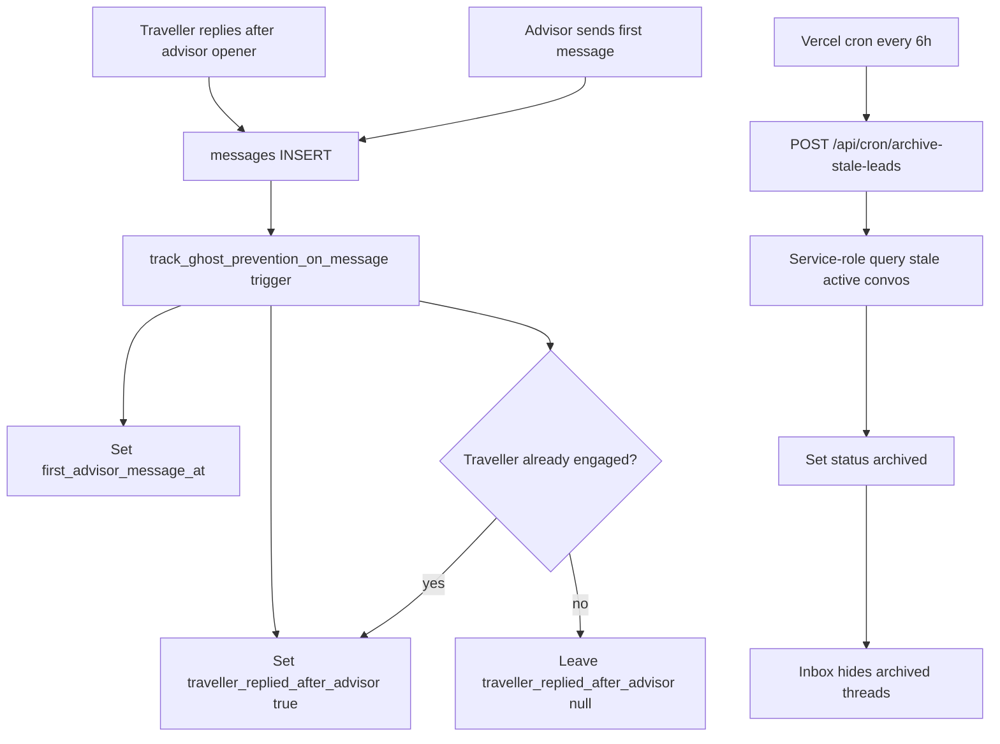

# Phase 5 -- 48-Hour Ghost Prevention

## Summary

If a traveller does not reply to an advisor's first message within 48 hours, the conversation is auto-archived so advisors are not stuck with dead leads. Tracking is **server-authoritative** (Postgres trigger on `messages` INSERT), not client-side updates — the implementation guide's `sendMessage` conversation updates would fail today because `conversations` has **no UPDATE RLS policy** for clients.

The archive job runs via a **secured Next.js API route** + Vercel cron (matches existing service-role patterns in [`match-sessions/route.ts`](advisor-profile/app/api/match-sessions/route.ts) and [`notifyMatchedAdvisors.ts`](advisor-profile/lib/push/notifyMatchedAdvisors.ts)).

---

## Current state vs Phase 5

| Area | Today | Phase 5 |
|------|-------|---------|
| `conversations` columns | `id`, `created_at`, `updated_at`, `match_session_id` | Add `status`, `first_advisor_message_at`, `traveller_replied_after_advisor` |
| Message send path | Client → `messages` INSERT via [`lib/chat/messages.ts`](advisor-profile/lib/chat/messages.ts) | Same path; trigger handles ghost tracking |
| Inbox query | [`lib/chat/inbox.ts`](advisor-profile/lib/chat/inbox.ts) returns all conversations | Filter `status = 'active'` |
| Scheduled jobs | None | `POST /api/cron/archive-stale-leads` every 6h |
| Edge Functions | None | Not used (per your choice) |

---

## Data flow



---

## Step 1 -- Database migration

Create [`supabase/migrations/20250616120000_conversation_ghost_prevention.sql`](advisor-profile/supabase/migrations/20250616120000_conversation_ghost_prevention.sql):

```sql
ALTER TABLE public.conversations
  ADD COLUMN IF NOT EXISTS status text NOT NULL DEFAULT 'active'
    CHECK (status IN ('active', 'archived', 'completed')),
  ADD COLUMN IF NOT EXISTS first_advisor_message_at timestamptz DEFAULT NULL,
  ADD COLUMN IF NOT EXISTS traveller_replied_after_advisor boolean DEFAULT NULL;

CREATE INDEX IF NOT EXISTS idx_conversations_status_advisor_msg
  ON public.conversations (status, first_advisor_message_at)
  WHERE status = 'active' AND first_advisor_message_at IS NOT NULL;
```

Add a `SECURITY DEFINER` trigger function `track_ghost_prevention_on_message()` on `AFTER INSERT ON messages` (alongside existing `touch_conversation_on_message`):

**Trigger logic (server-authoritative, uses `users.account_role` — never client `senderRole`):**

1. **Advisor first message:** If sender `account_role = 'advisor'` and `first_advisor_message_at IS NULL`:
   - Set `first_advisor_message_at = NEW.created_at`
   - If any prior traveller message exists in the conversation, immediately set `traveller_replied_after_advisor = true` (handles "traveller messaged first" edge case — they should not be ghost-archived)

2. **Traveller reply after advisor opener:** If sender `account_role = 'traveller'` and `first_advisor_message_at IS NOT NULL` and `traveller_replied_after_advisor IS NOT TRUE` and `NEW.created_at > first_advisor_message_at`:
   - Set `traveller_replied_after_advisor = true`

**No client UPDATE policy on `conversations`** — only the trigger and cron job (service role) mutate ghost fields. Participants retain SELECT-only access.

---

## Step 2 -- Update `database.types.ts`

Add the three new columns to the `conversations` table in [`lib/supabase/database.types.ts`](advisor-profile/lib/supabase/database.types.ts):

```typescript
status: 'active' | 'archived' | 'completed'
first_advisor_message_at: string | null
traveller_replied_after_advisor: boolean | null
```

---

## Step 3 -- Create `lib/guardrails/ghostPrevention.ts`

New file: [`lib/guardrails/ghostPrevention.ts`](advisor-profile/lib/guardrails/ghostPrevention.ts)

Pure, testable helpers (no Supabase client at module scope):

```typescript
export const GHOST_REPLY_WINDOW_MS = 48 * 60 * 60 * 1000

export type ConversationStatus = 'active' | 'archived' | 'completed'

export function isStaleGhostConversation(
  conv: {
    status: ConversationStatus
    first_advisor_message_at: string | null
    traveller_replied_after_advisor: boolean | null
  },
  nowMs: number = Date.now(),
): boolean {
  if (conv.status !== 'active') return false
  if (!conv.first_advisor_message_at) return false
  if (conv.traveller_replied_after_advisor === true) return false
  const firstMsgMs = new Date(conv.first_advisor_message_at).getTime()
  return nowMs - firstMsgMs >= GHOST_REPLY_WINDOW_MS
}

export function ghostArchiveCutoffIso(nowMs: number = Date.now()): string {
  return new Date(nowMs - GHOST_REPLY_WINDOW_MS).toISOString()
}
```

The cron route imports these helpers; trigger semantics are tested via the pure function.

---

## Step 4 -- Secured cron API route

Create [`app/api/cron/archive-stale-leads/route.ts`](advisor-profile/app/api/cron/archive-stale-leads/route.ts):

```typescript
// Auth: require Authorization: Bearer ${CRON_SECRET}
// Query (service-role):
//   status = 'active'
//   first_advisor_message_at IS NOT NULL
//   traveller_replied_after_advisor IS NULL
//   first_advisor_message_at < ghostArchiveCutoffIso()
// Update: status = 'archived'
// Return: { archived: number }
```

Pattern mirrors [`app/api/match-sessions/route.ts`](advisor-profile/app/api/match-sessions/route.ts):
- Module-level `createClient(url, SUPABASE_SERVICE_ROLE_KEY)`
- Structured logging: log count only, not message text or PII
- Return 401 if `CRON_SECRET` missing or header mismatch
- Return 500 on query/update errors

**New env var:** `CRON_SECRET` — random secret shared with Vercel cron.

---

## Step 5 -- Vercel cron schedule

Create [`vercel.json`](advisor-profile/vercel.json) at project root:

```json
{
  "crons": [
    {
      "path": "/api/cron/archive-stale-leads",
      "schedule": "0 */6 * * *"
    }
  ]
}
```

Vercel automatically sends `Authorization: Bearer <CRON_SECRET>` when `CRON_SECRET` is set in project env. Document this in a code comment on the route.

**Local/manual testing:** `curl -X POST -H "Authorization: Bearer $CRON_SECRET" http://localhost:3000/api/cron/archive-stale-leads`

---

## Step 6 -- Filter archived conversations in inbox

Edit [`lib/chat/inbox.ts`](advisor-profile/lib/chat/inbox.ts):

```typescript
.select('id, updated_at, status')
.in('id', conversationIds)
.eq('status', 'active')   // hide archived from inbox
.order('updated_at', { ascending: false })
```

Edit [`lib/chat/types.ts`](advisor-profile/lib/chat/types.ts) — add optional `status` to `InboxConversation` if needed for future UI badges.

**Scope:** Filter applies to both advisors and travellers (simpler, consistent). Archived threads disappear from sidebar lists for everyone.

---

## Step 7 -- Archived thread UX in `ChatMain`

Edit [`components/chat/ChatMain.tsx`](advisor-profile/components/chat/ChatMain.tsx):

When a user navigates directly to `/chat/[id]` for an archived conversation (possible via bookmark/history):

1. Add `fetchConversationStatus(conversationId)` in [`lib/chat/conversations.ts`](advisor-profile/lib/chat/conversations.ts) — participant-scoped SELECT of `status`
2. If `status === 'archived'`:
   - Show a banner: "This conversation was archived because there was no reply within 48 hours."
   - Disable the compose form (read-only thread)
   - Advisors see guidance to focus on active leads

This closes the direct-URL bypass that inbox filtering alone would leave open.

---

## Step 8 -- Tests

Create [`__tests__/ghostPrevention.test.ts`](advisor-profile/__tests__/ghostPrevention.test.ts):

**Pure function tests (`isStaleGhostConversation`):**
- Active + advisor messaged 49h ago + no traveller reply → stale (true)
- Active + advisor messaged 24h ago + no reply → not stale (false)
- Active + traveller replied → not stale (false)
- Already archived → not stale (false)
- No `first_advisor_message_at` → not stale (false)
- `ghostArchiveCutoffIso` returns ISO string 48h in the past

**Cron route tests (optional lightweight):**
- Mock env + auth header → 401 without secret
- Document manual integration steps for trigger + cron (below)

**Manual integration test steps (document in test file comment):**
1. Create conversation; advisor sends first message → verify `first_advisor_message_at` set in DB
2. Traveller replies → verify `traveller_replied_after_advisor = true`
3. Advisor sends first message after traveller already messaged → verify `traveller_replied_after_advisor` set immediately (no double-reply required)
4. Set `first_advisor_message_at` to 49h ago via SQL; run cron route → verify `status = 'archived'`
5. Verify archived conversation no longer appears in advisor inbox sidebar

---

## Security considerations

- **Never trust client `senderRole`** — trigger reads `users.account_role` from `NEW.sender_id`
- **No participant UPDATE on `conversations`** — ghost fields mutated only by `SECURITY DEFINER` trigger and service-role cron
- **`CRON_SECRET` required** — cron route returns 401 without valid bearer token; do not expose service-role key to client
- **Logging** — log archived count and conversation IDs only; no message text or traveller PII
- **`completed` status** — reserved for future use (e.g. booking closed); cron only archives to `archived`

---

## Files changed/created summary

| File | Action |
|------|--------|
| `supabase/migrations/20250616120000_conversation_ghost_prevention.sql` | Create |
| `lib/guardrails/ghostPrevention.ts` | Create |
| `app/api/cron/archive-stale-leads/route.ts` | Create |
| `vercel.json` | Create |
| `lib/supabase/database.types.ts` | Edit |
| `lib/chat/inbox.ts` | Edit |
| `lib/chat/types.ts` | Edit |
| `lib/chat/conversations.ts` | Edit (add `fetchConversationStatus`) |
| `components/chat/ChatMain.tsx` | Edit (archived read-only UX) |
| `__tests__/ghostPrevention.test.ts` | Create |

**Not changed:** [`lib/chat/messages.ts`](advisor-profile/lib/chat/messages.ts) — trigger handles tracking; no client-side conversation updates needed.

**New env var:** `CRON_SECRET` (required in production for cron auth).
