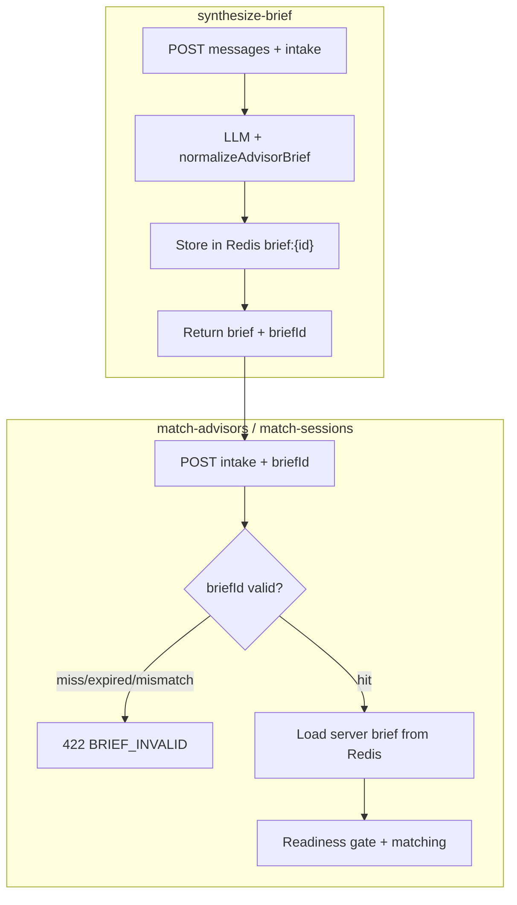

# Phase 6 -- Advanced Hardening

## Summary

Phases 1--5 shipped intake gates, readiness scoring, OTP, advisor preferences, and ghost prevention. The largest remaining vulnerability is **client brief spoofing**: [`match-advisors/route.ts`](advisor-profile/app/api/match-advisors/route.ts) and [`match-sessions/route.ts`](advisor-profile/app/api/match-sessions/route.ts) still accept a client-supplied `advisorBrief` and only apply ceiling heuristics ([`readiness.ts`](advisor-profile/lib/guardrails/readiness.ts)). Phase 2 explicitly deferred the full fix here.

Phase 6 makes the brief **server-authoritative** via an Upstash Redis cache (your choice), adds **composite rate limiting** beyond IP-only buckets, **aligns handoff gates with readiness thresholds**, introduces **structured telemetry + feature flags**, and adds **route integration tests**.



---

## Current gaps vs Phase 6

| Area | Today (after Phase 5) | Phase 6 |
|------|------------------------|---------|
| Brief trust | Client sends `advisorBrief` JSON; ceiling caps score | `briefId` from `synthesize-brief` is authoritative; spoofed scores rejected |
| Rate limits | IP-only via [`rateLimit.ts`](advisor-profile/lib/guardrails/rateLimit.ts) | Composite IP + optional `userId` / `briefId` buckets |
| Handoff vs readiness | [`handoffGates.ts`](advisor-profile/lib/handoffGates.ts) and readiness use separate rules | Shared constants + ceiling pre-check in chat handoff |
| Observability | Ad-hoc `console.info` per route | Central [`telemetry.ts`](advisor-profile/lib/guardrails/telemetry.ts) event schema |
| Tests | Pure-function unit tests only | Route handler tests with mocked Redis/Supabase |
| Rollout | All guardrails always on | Env feature flags for gradual enforcement |

---

## Step 1 -- Brief cache module (Upstash Redis)

**New file:** [`lib/guardrails/briefCache.ts`](advisor-profile/lib/guardrails/briefCache.ts)

Pure interfaces + Redis helpers (reuse Upstash env vars from rate limiting):

```typescript
export const BRIEF_CACHE_TTL_SEC = 2 * 60 * 60  // 2 hours

export type CachedBriefRecord = {
  brief: AdvisorBrief
  intakeHash: string   // stable hash of normalized intake
  userTurnCount: number
  createdAt: string
}

export function hashIntake(intake: MatchIntakePayload): string
export async function storeBriefCache(record: CachedBriefRecord): Promise<string>  // returns briefId (uuid)
export async function loadBriefCache(briefId: string, intake: MatchIntakePayload): Promise<CachedBriefRecord | null>
export async function deleteBriefCache(briefId: string): Promise<void>  // optional one-time use
```

**Redis key:** `tc-guardrails:brief:{uuid}` with `EX` TTL.

**Intake hash:** SHA-256 of canonical JSON (`destination`, `budgetLakh`, `travelStyle`, `vibe`, `pace`, `timing`, `duration`) so a `briefId` cannot be replayed against different intake.

**Graceful degradation (dev):** If Upstash env missing, `storeBriefCache` returns `null` briefId and routes fall back to current client-brief path (same pattern as rate limit skip).

---

## Step 2 -- Wire brief cache into synthesize-brief

**Edit:** [`app/api/synthesize-brief/route.ts`](advisor-profile/app/api/synthesize-brief/route.ts)

After `finalizeBrief(...)`:

1. Call `storeBriefCache({ brief, intakeHash, userTurnCount, createdAt })`
2. Return `{ brief, briefId, source }` (add `briefId: string | null`)

Log via telemetry: `brief_cached` with `{ route, tier, score, hasBriefId }` -- no message text or PII.

---

## Step 3 -- Enforce briefId on match routes

**New helper:** [`lib/guardrails/resolveBrief.ts`](advisor-profile/lib/guardrails/resolveBrief.ts)

```typescript
export type BriefResolveResult =
  | { ok: true; brief: AdvisorBrief; source: 'cache' | 'legacy' }
  | { ok: false; response: NextResponse }  // 422 BRIEF_INVALID

export async function resolveAdvisorBrief(
  body: unknown,
  intake: MatchIntakePayload,
  route: string,
): Promise<BriefResolveResult>
```

Logic:

1. If `briefId` present: `loadBriefCache(briefId, intake)` -- on miss/expired/hash mismatch → 422 `{ blocked: true, code: 'BRIEF_INVALID', message: '...' }`
2. If `GUARDRAILS_REQUIRE_BRIEF_ID=true` (production default) and no `briefId` → 422 (blocks direct API spoofing)
3. If flag off (local dev): fall back to legacy `advisorBrief` body parsing + `normalizeAdvisorBrief` (current behavior)

**Edit:** [`app/api/match-advisors/route.ts`](advisor-profile/app/api/match-advisors/route.ts) and [`app/api/match-advisors/local/route.ts`](advisor-profile/app/api/match-advisors/local/route.ts) -- replace inline brief parsing with `resolveAdvisorBrief`.

**Edit:** [`app/api/match-sessions/route.ts`](advisor-profile/app/api/match-sessions/route.ts) -- same; persist readiness from resolved server brief only.

**Edit:** [`lib/guardrails/matchFetch.ts`](advisor-profile/lib/guardrails/matchFetch.ts) -- accept optional `briefId`, include in POST body; handle `BRIEF_INVALID` with `MatchGuardrailError`.

**Edit:** [`components/matching/StepAIConcierge.tsx`](advisor-profile/components/matching/StepAIConcierge.tsx) -- capture `briefId` from synthesize response, pass to parent via `onHandoff(brief, briefId)`.

**Edit:** [`app/page.tsx`](advisor-profile/app/page.tsx), [`app/start/page.tsx`](advisor-profile/app/start/page.tsx), [`components/matching/StepMatching.tsx`](advisor-profile/components/matching/StepMatching.tsx) -- thread `briefId` through handoff → matching → `saveMatchSession`.

**Edit:** [`lib/matchSession.ts`](advisor-profile/lib/matchSession.ts) -- add `briefId?: string | null` to `MatchSessionSnapshot` for session restore parity.

---

## Step 4 -- Composite per-user rate limiting

**Edit:** [`lib/guardrails/rateLimit.ts`](advisor-profile/lib/guardrails/rateLimit.ts)

Extend signature:

```typescript
export type RateLimitContext = {
  userId?: string | null      // from supabase.auth.getUser() when available
  briefId?: string | null     // funnel-scoped key for post-handoff routes
}

export async function checkRateLimit(
  request: Request,
  bucket: RateLimitBucket,
  route: string,
  ctx?: RateLimitContext,
): Promise<NextResponse | null>
```

**Key strategy:**

| Bucket | Primary key | Secondary key (if authenticated) |
|--------|-------------|----------------------------------|
| `chat`, `synthesize-brief` | `ip:{ip}` | `user:{uid}` (tighter limit for logged-in abuse) |
| `match-advisors`, `match-sessions` | `ip:{ip}` | `brief:{briefId}` (max 5 match attempts per cached brief) |

Both keys must pass (AND semantics) when secondary is present.

**Suggested secondary limits:**

- `user:*` on LLM routes: 25 req/min (higher than anon IP 15 -- verified users get headroom)
- `brief:*` on match routes: 5 req/10min per briefId (prevents match-spam with one valid brief)

**Edit routes** to pass context:
- `synthesize-brief`: try `createClient().auth.getUser()` for `userId`
- `match-advisors` / `match-sessions`: pass `briefId` from parsed body

Enable only when `GUARDRAILS_PER_USER_RATE_LIMIT=true` (default true in production).

---

## Step 5 -- Reconcile handoffGates vs readiness

**Edit:** [`lib/guardrails/constants.ts`](advisor-profile/lib/guardrails/constants.ts)

Add shared handoff constants:

```typescript
export const MIN_HANDOFF_USER_TURNS = 3
export const HANDOFF_MIN_CONFIDENCE = 0.75
```

**Edit:** [`lib/handoffGates.ts`](advisor-profile/lib/handoffGates.ts)

- Import constants instead of magic numbers
- Add optional `readinessCeiling?: number` to `HandoffGateInput`
- New rule (after turn count, before accept): if `readinessCeiling !== undefined` and `readinessCeiling < READINESS_TIER_THRESHOLDS.nurture` **and not override** → reject with suggested follow-up

**Edit:** [`app/api/chat/route.ts`](advisor-profile/app/api/chat/route.ts) handoff tool `execute`:

```typescript
const ceiling = estimateReadinessCeiling(intake, userTurnCount)
const gate = evaluateHandoffGate({ override, confidence, intent, userTurnCount, readinessCeiling: ceiling })
```

**Explicit override** (`talk to human` regex) still bypasses ceiling -- user can always request handoff, but matching remains server-gated by real brief score. This avoids trapping users while closing the spoofing hole via brief cache.

**Align synthesize prompt:** Update tier text in [`synthesize-brief/route.ts`](advisor-profile/app/api/synthesize-brief/route.ts) to reference `READINESS_TIER_THRESHOLDS` from constants (hot 75, warm 58, nurture 42) -- remove drift between prompt and `deriveReadinessTier`.

---

## Step 6 -- Telemetry and feature flags

**New file:** [`lib/guardrails/telemetry.ts`](advisor-profile/lib/guardrails/telemetry.ts)

Typed events (JSON `console.info` / `console.warn` for Vercel log drains):

```typescript
export type GuardrailEvent =
  | { event: 'intake_blocked'; route: string; field?: string }
  | { event: 'rate_limited'; route: string; bucket: string }
  | { event: 'readiness_blocked'; route: string; tier: string; score: number }
  | { event: 'brief_cached'; route: string; tier: string; score: number }
  | { event: 'brief_cache_miss'; route: string; reason: 'not_found' | 'expired' | 'intake_mismatch' }
  | { event: 'handoff_rejected'; reason: string; ceiling?: number }
  | { event: 'ghost_archived'; count: number }

export function logGuardrailEvent(payload: GuardrailEvent): void
```

Replace scattered `[readiness-gate]`, `[intake-gate]`, `[handoff]` logs in guardrail routes with `logGuardrailEvent`. Never log IP, phone, message text, or traveller names.

**New file:** [`lib/guardrails/featureFlags.ts`](advisor-profile/lib/guardrails/featureFlags.ts)

```typescript
export function requireBriefId(): boolean
export function perUserRateLimitEnabled(): boolean
```

Env vars:

| Var | Default (prod) | Purpose |
|-----|----------------|---------|
| `GUARDRAILS_REQUIRE_BRIEF_ID` | `true` | Reject match without valid `briefId` |
| `GUARDRAILS_PER_USER_RATE_LIMIT` | `true` | Enable composite rate limit keys |

Local dev: both default `false` when unset (preserves current DX).

---

## Step 7 -- Integration / route tests

**New file:** [`__tests__/briefCache.test.ts`](advisor-profile/__tests__/briefCache.test.ts)

- `hashIntake` stability (same intake → same hash; different destination → different hash)
- Mock Redis: store → load hit; TTL expiry; intake mismatch returns null

**New file:** [`__tests__/resolveBrief.test.ts`](advisor-profile/__tests__/resolveBrief.test.ts)

- With `GUARDRAILS_REQUIRE_BRIEF_ID=true`: body without `briefId` → 422 `BRIEF_INVALID`
- Valid `briefId` + matching intake → resolved brief used
- Spoofed `advisorBrief` with `briefId` present → cache wins, client score ignored

**New file:** [`__tests__/rateLimitComposite.test.ts`](advisor-profile/__tests__/rateLimitComposite.test.ts)

- Mock Upstash: IP pass + brief bucket exhausted → 429
- Feature flag off → secondary check skipped

**Extend:** [`__tests__/handoffGates.test.ts`](advisor-profile/__tests__/handoffGates.test.ts)

- Ceiling below nurture + no override → rejected
- Override + low ceiling → accepted (existing override behavior)

**Manual integration steps (document in test file comment):**

1. Complete funnel handoff → verify synthesize response includes `briefId`
2. `POST /api/match-advisors` with only `briefId` (no `advisorBrief`) → advisors returned
3. Replay same `briefId` with altered `destination` → 422 `BRIEF_INVALID`
4. `POST /api/match-advisors` with crafted `readiness_score: 99` but no `briefId` (prod flag on) → 422
5. Burst match requests with same `briefId` → 429 after brief-scoped limit

---

## Security considerations

- **Brief cache is write-once server-side** -- only `synthesize-brief` stores; clients never write Redis
- **`briefId` is opaque UUID** -- no JWT needed; security is intake-hash binding + TTL
- **One-time use optional** -- consider `deleteBriefCache` after successful `match-sessions` insert to prevent briefId replay for repeated matching (recommended)
- **Rate limit keys** -- never log raw IP; log bucket name only
- **Feature flags** -- allow instant rollback without redeploying route logic
- **Legacy path** -- dev-only fallback; production must set `GUARDRAILS_REQUIRE_BRIEF_ID=true`

---

## Files changed/created summary

| File | Action |
|------|--------|
| `lib/guardrails/briefCache.ts` | Create |
| `lib/guardrails/resolveBrief.ts` | Create |
| `lib/guardrails/telemetry.ts` | Create |
| `lib/guardrails/featureFlags.ts` | Create |
| `lib/guardrails/rateLimit.ts` | Edit (composite keys) |
| `lib/guardrails/constants.ts` | Edit (handoff constants) |
| `lib/handoffGates.ts` | Edit (ceiling alignment) |
| `app/api/synthesize-brief/route.ts` | Edit (cache + briefId) |
| `app/api/match-advisors/route.ts` | Edit (resolveBrief) |
| `app/api/match-advisors/local/route.ts` | Edit (resolveBrief) |
| `app/api/match-sessions/route.ts` | Edit (resolveBrief) |
| `app/api/chat/route.ts` | Edit (ceiling in handoff + telemetry) |
| `lib/guardrails/matchFetch.ts` | Edit (briefId) |
| `components/matching/StepAIConcierge.tsx` | Edit (capture briefId) |
| `components/matching/StepMatching.tsx` | Edit (pass briefId) |
| `app/page.tsx`, `app/start/page.tsx` | Edit (thread briefId) |
| `lib/matchSession.ts` | Edit (snapshot briefId) |
| `__tests__/briefCache.test.ts` | Create |
| `__tests__/resolveBrief.test.ts` | Create |
| `__tests__/rateLimitComposite.test.ts` | Create |
| `__tests__/handoffGates.test.ts` | Extend |

**New env vars:** `GUARDRAILS_REQUIRE_BRIEF_ID`, `GUARDRAILS_PER_USER_RATE_LIMIT` (no new infra -- reuses existing Upstash Redis).

---

## Acceptance criteria

- [ ] `synthesize-brief` returns `briefId` and stores normalized brief in Redis
- [ ] `match-advisors` with spoofed `readiness_score: 99` and no `briefId` returns 422 in production mode
- [ ] Valid `briefId` + matching intake returns advisors; mismatched intake returns 422
- [ ] Composite rate limit blocks burst match spam per `briefId`
- [ ] Handoff rejected when ceiling below nurture (unless explicit override)
- [ ] All guardrail routes emit structured telemetry events
- [ ] All unit/integration tests pass (`npm test`)
- [ ] Feature flags allow disabling briefId requirement for local dev

---

## Estimated effort

| Task | Time |
|------|------|
| briefCache + resolveBrief modules | 2h |
| Route wiring (4 API routes + client thread) | 2.5h |
| Composite rate limiting | 1.5h |
| Handoff/readiness alignment + prompt sync | 1h |
| Telemetry + feature flags | 1h |
| Tests | 2h |
| **Total Phase 6** | **~10h** |
