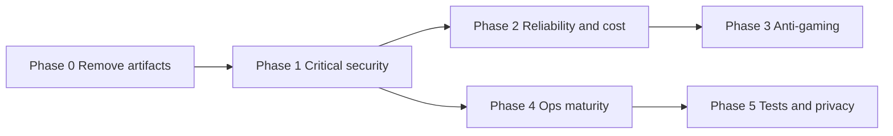

# Pilot Hardening Plan: advisor-profile

Fixes are grouped into phases by urgency. Each phase is independently shippable. Phases 0-2 are the true pilot blockers; 3-5 harden quality and operability.

Two decisions are pre-decided with a recommended default (change at confirm time if you disagree):
- Funnel stays anonymous (no login wall). We close the abuse holes with a signed funnel token + honeypot + fail-closed rate limiting instead of forcing auth.
- Fraud vetting (SEON) flips to fail-closed-to-quarantine in production, so a SEON outage parks leads for admin review instead of silently passing them.

Out of scope: the unbuilt Cal.com scheduling flow (`calcom_scheduling_flow_9d12f72f.plan.md`) and any payments work - those are net-new features, not fixes.

---

## Phase 0 - Remove debug/dev artifacts (fast, low risk)

- Delete `[advisor-profile/app/api/test/route.ts](advisor-profile/app/api/test/route.ts)` (public unauthenticated probe).
- Gate test-advisor injection behind `NODE_ENV !== 'production'` in `[advisor-profile/lib/guardrails/testAdvisor.ts](advisor-profile/lib/guardrails/testAdvisor.ts)`; verify call sites in `[advisor-profile/app/api/match-advisors/route.ts](advisor-profile/app/api/match-advisors/route.ts)` and `[advisor-profile/app/api/match-advisors/local/route.ts](advisor-profile/app/api/match-advisors/local/route.ts)` become no-ops in prod.
- Add `supabase/.temp/` and `data/match.db` to `[advisor-profile/.gitignore](advisor-profile/.gitignore)`; confirm `.temp` is not already tracked (`git rm --cached` if so).
- Remove unused `@ai-sdk/anthropic` dependency and root-level `test-*.js` probe scripts.

## Phase 1 - Critical security (one DB migration + app changes)

New migration in `advisor-profile/supabase/migrations/` (timestamped after `20250623120000_onboarding_payload.sql`):

- Lock `account_role`: add a `BEFORE UPDATE` trigger (or `WITH CHECK` that compares `OLD.account_role`) on `public.users` so a user cannot self-promote to `admin`, and `revoke update (account_role) on public.users from authenticated`. Closes the privilege-escalation chain in `[advisor-profile/lib/admin/isAdmin.ts](advisor-profile/lib/admin/isAdmin.ts)`.
- Enable RLS on `seon_cache` with no client policies (service-role only):
  `alter table public.seon_cache enable row level security;`
- Replace the open `match_sessions` INSERT policy (`with check (true)`) with a deny for client roles, so inserts only happen via the service-role API (`[advisor-profile/app/api/match-sessions/route.ts](advisor-profile/app/api/match-sessions/route.ts)`).
- Add the missing `conversations` UPDATE RLS policy (participants only) so `link_conversation_to_match_session` stops failing silently.
- Add indexes: `lead_assignments(traveller_user_id)`, `session_telemetry(traveller_user_id)`.

App changes:
- Make the admin gate authoritative via the DB `is_admin()` function rather than trusting the client-writable column alone, in `[advisor-profile/lib/admin/isAdmin.ts](advisor-profile/lib/admin/isAdmin.ts)` and its callers under `advisor-profile/app/api/admin/`.
- Fix the IDOR in `[advisor-profile/app/api/leads/request/route.ts](advisor-profile/app/api/leads/request/route.ts)`: verify `matchSessionId` belongs to the authenticated user before any service-role write.
- Protect `/admin/*` in `[advisor-profile/lib/supabase/middleware.ts](advisor-profile/lib/supabase/middleware.ts)` `PROTECTED_PREFIXES` (defense-in-depth on top of page checks).

## Phase 2 - Reliability and cost (deploy + abuse hardening)

- Build `data/match.db` in the pipeline: invoke `build:match-index` from `build` in `[advisor-profile/package.json](advisor-profile/package.json)` (or a Vercel build step); confirm the file ships in the function bundle via existing `data/**` tracing in `[advisor-profile/next.config.ts](advisor-profile/next.config.ts)`. Add a fast fail-with-clear-error if the DB is missing at boot.
- Fail closed on rate limiting in production in `[advisor-profile/lib/guardrails/rateLimit.ts](advisor-profile/lib/guardrails/rateLimit.ts)`: if Upstash env is missing in prod, block instead of returning `null`.
- Protect + budget the LLM endpoints (`[advisor-profile/app/api/chat/route.ts](advisor-profile/app/api/chat/route.ts)`, `[advisor-profile/app/api/synthesize-brief/route.ts](advisor-profile/app/api/synthesize-brief/route.ts)`): issue a signed funnel token at match start and require it; cap message count and total input tokens; add per-day cost/usage logging; add rate limit to `match-advisors/local`.
- Make mock-mode fallback explicit: when the Gemini key is missing or all models fail, surface a real error in production instead of silently switching to `[advisor-profile/lib/mockConciergeStream.ts](advisor-profile/lib/mockConciergeStream.ts)` (which auto-approves handoff).
- SEON posture: default to fail-closed-to-quarantine in production in `[advisor-profile/lib/vetting/seon.ts](advisor-profile/lib/vetting/seon.ts)` / `[advisor-profile/lib/vetting/runLeadVetting.ts](advisor-profile/lib/vetting/runLeadVetting.ts)`.

## Phase 3 - Anti-gaming of vetting signals

- Bind telemetry/readiness/transcript to the server session so they can't be forged:
  - Stop trusting client `advisorBrief` readiness in `[advisor-profile/app/api/match-sessions/route.ts](advisor-profile/app/api/match-sessions/route.ts)`; always apply the turn-count ceiling in `[advisor-profile/lib/guardrails/readiness.ts](advisor-profile/lib/guardrails/readiness.ts)`.
  - Validate that the synthesize-brief transcript corresponds to a real chat session (persist/verify rather than accept raw client `messages[]`).
- Add a honeypot field + stricter rate limit to `[advisor-profile/app/api/onboarding/submit/route.ts](advisor-profile/app/api/onboarding/submit/route.ts)`; consider deferring raw PII persistence until phone OTP is verified.

## Phase 4 - Operational maturity

- Add CI (`.github/workflows/ci.yml`): install, lint, `vitest run`, build `match.db`, `next build`, and the Playwright suite; add a check that `database.types.ts` is in sync with migrations.
- Add env validation: a Zod-validated env module loaded from `instrumentation.ts` that fails fast on missing required vars; add a root `.env.example` documenting all ~20 vars (Supabase, `CRON_SECRET`, Upstash, Gemini, SEON, Resend, `ADMIN_EMAILS`, feature flags).
- Observability: add Sentry (or equivalent) + a small structured logger + request/correlation IDs; ensure no PII (the contact details currently embedded in `[advisor-profile/lib/conciergePrompt.ts](advisor-profile/lib/conciergePrompt.ts)`) is ever logged.
- Regenerate `[advisor-profile/lib/supabase/database.types.ts](advisor-profile/lib/supabase/database.types.ts)` to include the onboarding columns and `'blocked'` lead status.

## Phase 5 - Tests, integrity, privacy review

- Add route-level/integration tests for auth, `/api/chat`, `runLeadVetting`, cron jobs, admin, and onboarding; extend E2E beyond the 2 vetting cases (chat-after-match, advisor respond-lead, admin quarantine).
- Add an idempotency key to `match_sessions` to dedupe funnel retries.
- Review broad PII read policies (`users`, `advisor_user_links`, advisor reads of `match_sessions` contact fields) against your privacy commitments; tighten where they exceed need.

---

## Suggested sequencing

Phases 0-2 must land before the pilot. Phase 4 (CI + env validation + observability) should ideally land in parallel so the pilot is debuggable. Phases 3 and 5 can continue during the pilot.